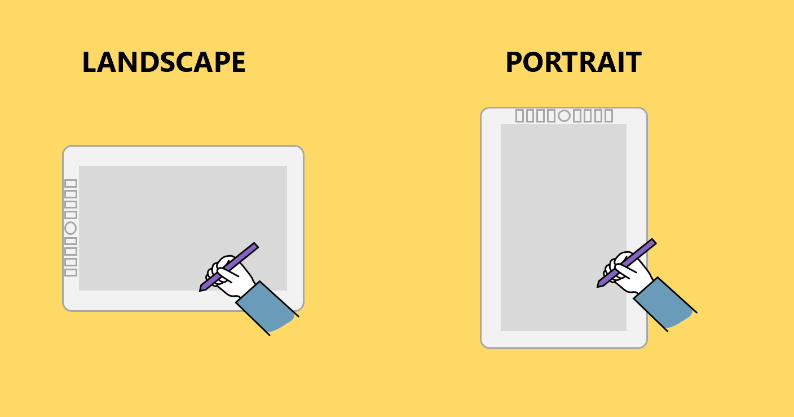

# Using a drawing tablet in portrait or landscape orientation

By default, drawing tablets are configured for landscape orientation. However, all drawing tablets can also be configured for portrait orientation. This applies to both pen tablets and pen displays.

<figure><figcaption></figcaption></figure>

This is done via a "rotation." You will at least need to make a change in the tablet driver. If you are using a pen display, you will also need to change the display settings in your computer's operating system. These rotation instructions are here: [Rotating a drawing tablet](rotating-drawtab.md)
