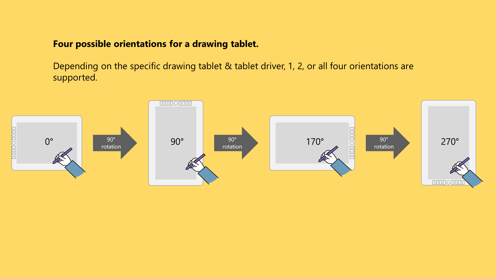
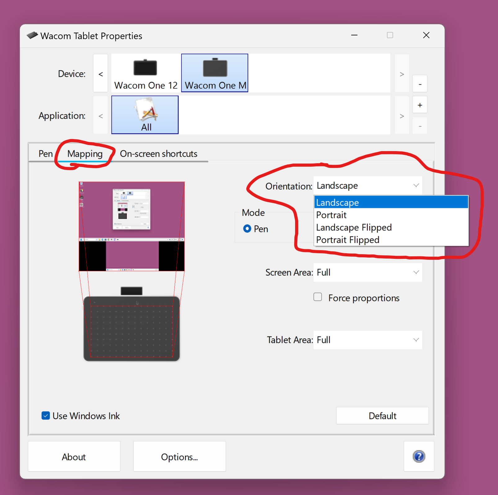
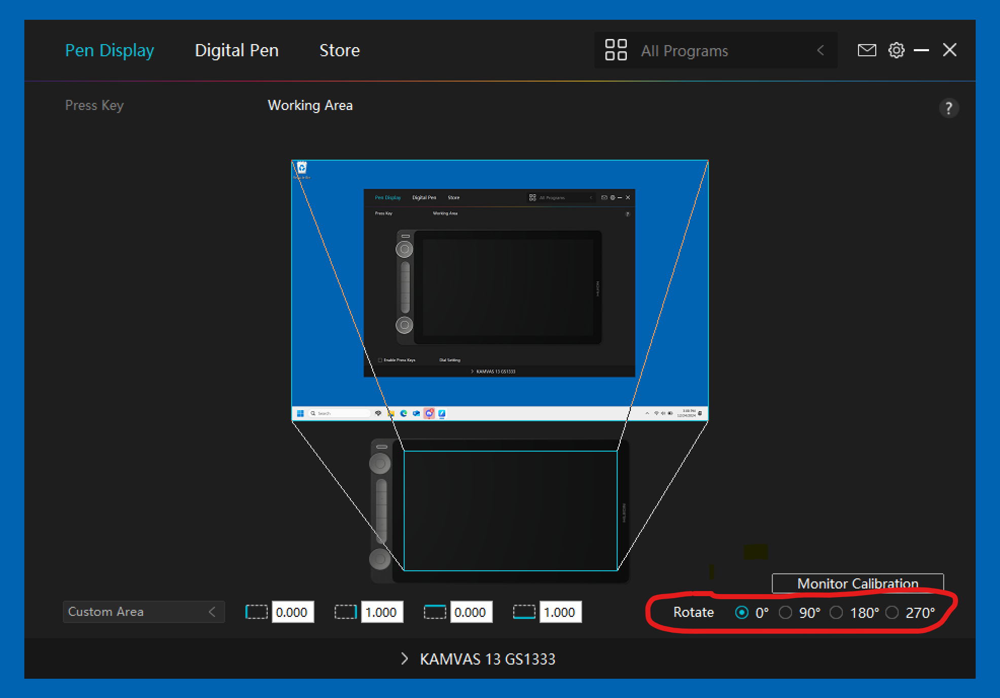
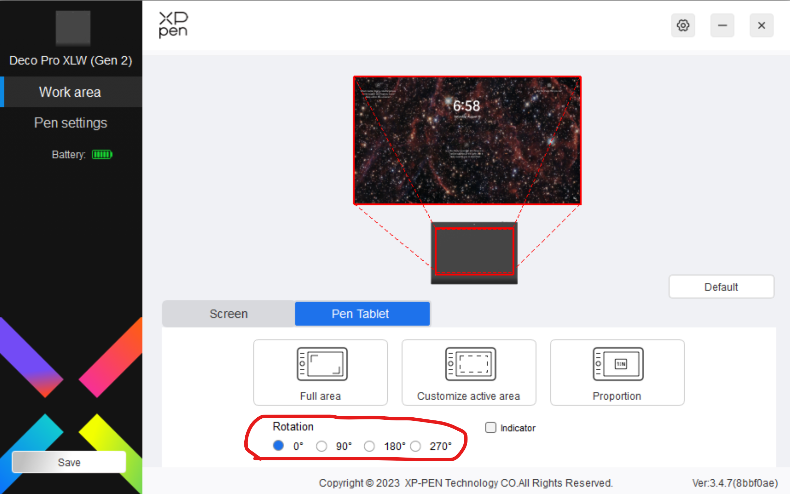

# Rotating a drawing tablet

For various reasons you may want to rotate your tablet to use it in a different orientation.

Most drawing tablets support these rotations:

* Some support all four orientations
* Some only support two orientations
* Some support only a single orientation

<figure><figcaption></figcaption></figure>

## **Summary of steps**

* Configure the driver app to perform the rotation
* If you have a pen display
  * ensure you are extending the desktop to the pen display, not duplicating it
  * In the system's display settings, rotate the desktop on the pen display
* Physically rotate the tablet
* You can perform these steps in any order.

## Notes for pen displays

If you have a monitor and a pen display, your desktop is either:

* **duplicated/mirrored** across both (both show the exact same thing)
* or **extended** across them (they show different things)

If you want to rotate your tablet, then you have to use the **extended** setting. You can certainly choose the duplicated or mirrored setting, but it will not give you the behavior that you want.

## Video Demonstration

Here is a demonstration of how to rotate a pen display: [https://youtu.be/\_OkANovOxBQ](https://youtu.be/_OkANovOxBQ)



## Rotating in the Driver

### Wacom

Note that not all Wacom tablets have an Orientation option.

### Huion driver

<figure><figcaption></figcaption></figure>

### XP-Pen driver

## Brand-specific information

* HUION - [Setting Up the Left-hand Mode for Your Huion Tablets](https://support.huion.com/en/support/solutions/articles/44001164173-setting-up-the-left-hand-mode-for-your-huion-tablets)

## Rotating in the operating system's Display Settings

* Windows instructions: [https://support.microsoft.com/en-us/windows/change-screen-orientation-f7ab1ff8-971d-58a5-b8ee-bc113bbf3acb](https://support.microsoft.com/en-us/windows/change-screen-orientation-f7ab1ff8-971d-58a5-b8ee-bc113bbf3acb)
* MacOS instructions: [https://support.apple.com/guide/mac-help/rotate-the-image-on-your-display-mh11534](https://support.apple.com/guide/mac-help/rotate-the-image-on-your-display-mh11534)
