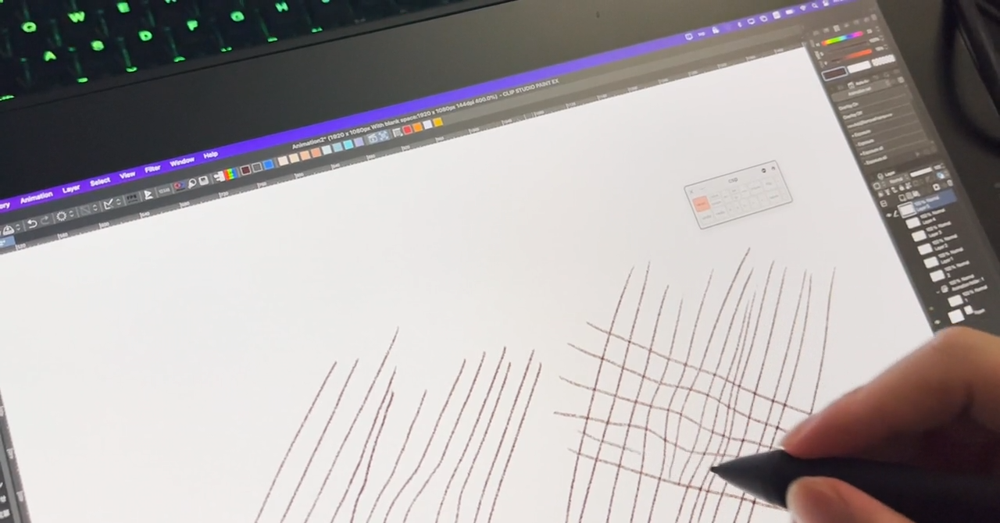
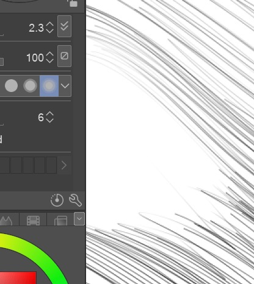

# Electromagnetic Interference

## Introduction

Electromagnetic Interference (EMI) can occur between your tablet and other devices. Devices could include cell phones or keyboards. It doesn't even really have to be a device- sometimes ordinary non electronic objects have magnets inside of them that can interfere with a tablet.

## Effects of EMI

### **Jerky or stuttering pen position tracking**

EMI can make the pen have jerky movements - making the pen unresponsive for a few tenths of a second and then the pointer will catch up.

### **Warped regions**

Sometimes the EMI takes the form of a region that warps straight lines. Below is an example of such a warping caused by a magnet. This this case it was a magnet attacked to a stand underneath the tablet. ([See this reddit thread](https://www.reddit.com/r/huion/comments/13yef7f/kamvas\_13\_digitizer\_problem/))

<figure><figcaption></figcaption></figure>

### **Skipped regions**

EMI interference can also present as a region where pen seems unable to make a mark. Notice that some warping is also present. In this case, the causes was that the tablet was resting upon a laptop keyboard. Note that there is also some warping of the pen position. ([See this reddit thread](https://www.reddit.com/r/XPpen/comments/14joyq5/pen\_skips\_across\_the\_screen\_in\_certain\_spots\_help/))

<figure><figcaption></figcaption></figure>

## Tablets interfering with other devices

Sometimes it is the tablet that is interfering with another device.

Examples:

* A wireless mouse might have trouble working near some tablets.
* A tablet might interfere with your WiFi network connection
  * See: [Troubleshoot WiFi and Internet problems with drawing tablets](../../troubleshooting/troubleshoot-wifi-and-internet-problems-with-drawing-tablets.md)&#x20;

## General weirdness

Weird things can happen! I have a keyboard, that when I unplug its USB-C cable will act like a pen and control the position of the pointer on one of my tablets!
