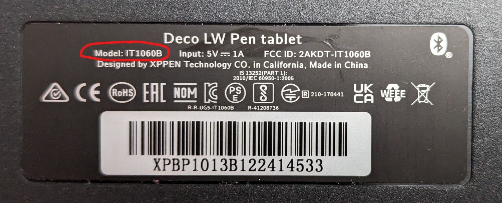
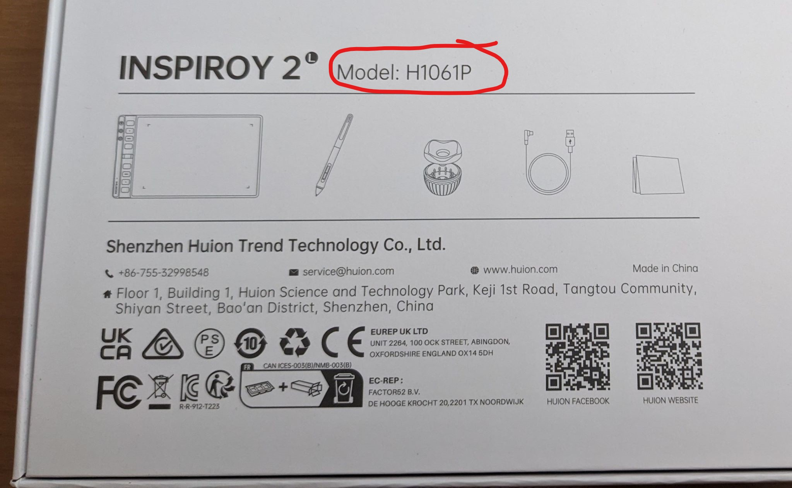

# Finding the model number of a drawing tablet

## Overview

One of the most important pieces of information you need to collect if you need help with your drawing tablet is its model number. Knowing it will accelerate discussions with support and with community members who are trying to help you.

One reason it is very useful is that tablet are sometimes often similarly named, and sometimes they have the same name but come from different generations from different years. Having the model number removed ambiguity about which tablet is being discussed.

## Model number is printed on the tablet

Usually the model number is printed on the back of the tablet.

In some tablets the model number is printed, but in a more hidden location. For example, some tablets might show it hidden under a leg or behind some removable panel.

Occasionally, you may find that the model number has been worn off the tablet. In this case, you'll have to try other options.

Here's an example from the packaging of the XP-Pen Deco LW

<figure><figcaption></figcaption></figure>

## Model number is shown in the driver

If you have installed compatible tablet drivers for your drawing tablet usually there's some place where the drivers will tell you the exact model number.

This will typically we found in some kind of diagnostic tool in the tablet driver UI.

Here are some examples:

### Model number in the Wacom Tablet Properties app

Click **About > Diagnose**

<figure><figcaption></figcaption></figure>

### Model number in the Wacom Center app

When you select a tablet you will see it right on the home page for that tablet.&#x20;

<figure><figcaption></figcaption></figure>

### Model number in the Huion driver (HuionTablet app)

As of 2024/02/27 the driver app does not provide any way to see the model number, only the name.

### Model number in XP driver app

As of 2024/02/27 the driver app does not provide any way to see the model number, only the name.

## Find the model number on the packaging the tablet arrived in

If you got your tablet inside its original packaging, the model number may be printed somewhere.

Here's an example from the packaging of the Huion Inspiroy 2 L.

<figure><figcaption></figcaption></figure>

## Find the model number in the documentation

If you have the original documentation that came with the tablet, it might also contain the model number.

## Find the model number based on photos

Sometimes you don't have the driver and you don't see the model number so you're going to have to go just by the way the device looks.

And for this you need the help of either customer support from your drawing tablet manufacturer or you need help from the community.

In either case what you can do here is take some pictures of the tablet: front, back, sides that have ports, etcetera. Any photos that show distinguishing characteristics can be useful.

Make sure to get some clear lighting on the tablet because many tablets are black plastic or dark Gray plastic and so it can be really difficult to make out visuals.
