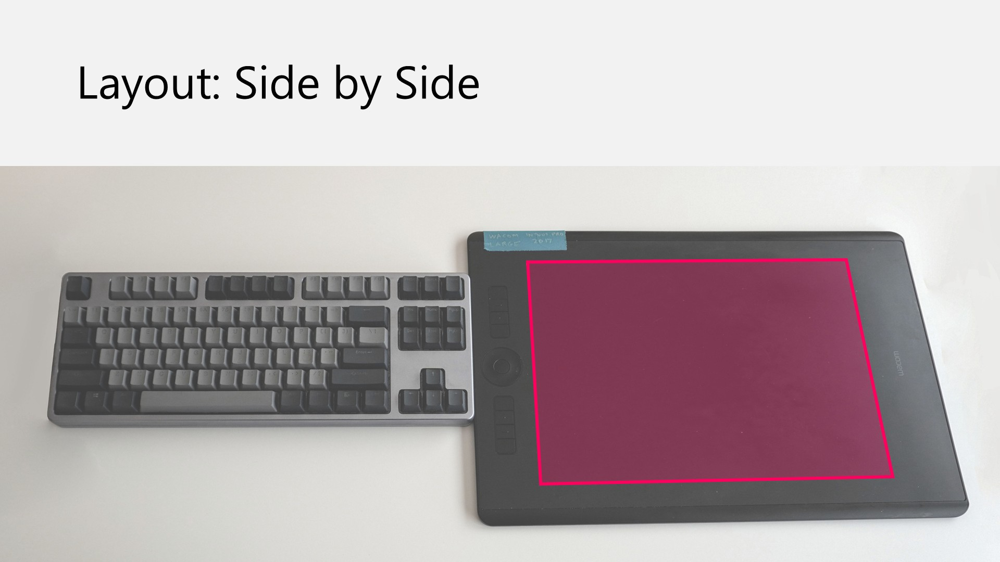
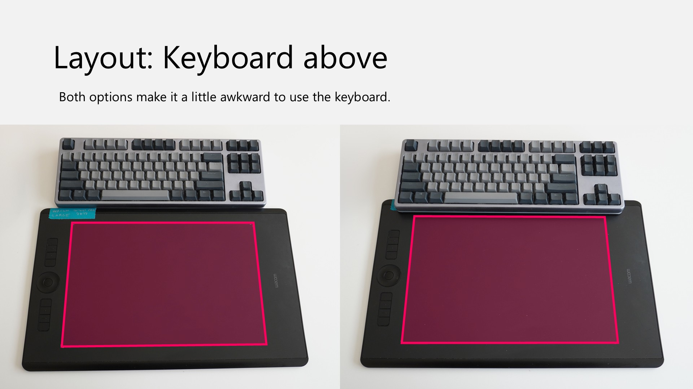
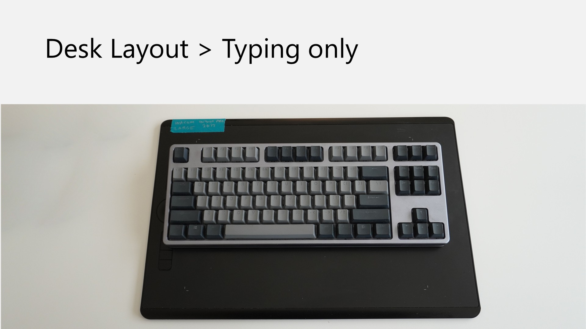

# Using large pen tablets

## Overview

A LARGE pen tablet has an active area diagonal of about 15 inches (38 cm).

## Large size versus other tablets

<figure><figcaption></figcaption></figure>

<figure><figcaption></figcaption></figure>

<figure><figcaption></figcaption></figure>

## Video

In this video I go through a lot of detail about what it's like to actually use a large pen tablet. In this case I'm specifically using a Wacom intuos pro (PTH-860). But the same general issues apply to any large pen tablet.



## Who should get a large pen tablet

Generally I advise against getting a LARGE pen tablet unless one of these is trye:

* You already have experience using one
* You are confident that your art style will benefit from the size and you are ready to deal with the ergonomic issues that come from using one.

## Large pen tablets in the market

See: [Large pen tablet recommendations](../../recs/pen-tablet-recs-large.md)

## My personal experience

I have used LARGE pen tablets are my favorite size to use and I have described the experience as "luxurious." However I did have to adjust how I setup my desktop and how I draw to take advantage of it. It did take my some time to adapt, but now I would not go back to using a MEDIUM pen tablet.

## Potential benefits

* **Smoother Lines and More Control:** For illustration, especially with styles involving a lot of long lines, the large tablet helps me have smoother lines and more control.
* **Encourages Larger Gestures:** The larger active area naturally encourages drawing gestures to get a bit larger," which in turn leads to "smoother lines and more control."

## When large sized pen tablets may be unhelpful

* Using the tablet as a mouse replacement
* Photo editing - no benefit from the size

## Adjustments and tactics for optimal use

Despite the benefits, maximizing the large tablet's value requires conscious effort to your desk setup and how you draw: **You have to overcome old habits:** When I started I would fall back to my older habits when i had a medium pen tablet - making smaller gestures and not fully utilizing the larger area.

Some tactics I applied:

* **Conscious Arm/Shoulder Movement:** I tried to stay very conscious about using more of my arm and shoulder to draw with instead of just my wrist.
* **Application configuration:** Rearranging palettes in drawing software (e.g., Clip Studio Paint) to create more canvas space for drawing can psychologically influence me to draw in a larger way.
* **Larger display:** Switching from a 27-inch 4K display to a 32-inch 4K display had psychological impact on me. When I saw my drawing shown large on the screen, it helped remind me to use large gestures

I think it's important that you spend some deliberate time learning how to make the best use of all the extra active area that you have. That means you may have to put in some work in changing how you draw because ultimately if you are not using this extra active area then you are wasting the active area that you paid for.

## Positioning relative to keyboard

### Side-by Side: doesn't work well

With a medium pen tablet most people put their tablet to the right or left of their keyboard. You can certainly try this with a large pen tablet. But what you'll discover is that it is extremely difficult to reach the more distant edges of the keyboard or tablet depending on how they're situated in front of you.

<figure><figcaption></figcaption></figure>

### Keyboard above, tablet below: Good for drawing

So a large pen tablet typically means you will have to have it directly in front of you. And then you place the keyboard above it. This of course means that it's more difficult to reach the keyboard.  When I am drawing this is the layout I use.

I sometimes pull the keyboard closer and put it on the top bezel of the tablet. This makes it slightly easier to reach the keyboard though it still is a little awkward.

<figure><figcaption></figcaption></figure>

### Keyboard on top: For typing&#x20;

Often if I'm not really drawing I'll in fact put the keyboard on top of the tablet.

<figure><figcaption></figcaption></figure>

## Effort

With a large pen tablet your hand is really moving quite a distance to do some things. So for example if you are trying to reach a menu item at the very top of the screen you might be surprised how much distance you're going to have to move your pen. This can be very tiring for some people.

In my initial phase of using the tablet, I felt that my hand was moving a larger distance than normal. It definitely gelt like an extra effort. But it did not fund not too tiring, but I did notice it. This sensation dissipated after about a month. After that it felt normal.

## What if the active area feels too big?

If the active area is too big for you, then you should keep in mind that you can always scale down the active area to any size you want. For example, You can make the active area match a medium sized tablet for example.
