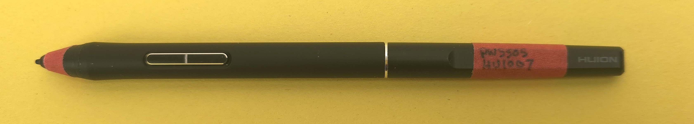

# Maintaining your drawing tablet

## Introduction

With a little care and light maintenance, your tablet will keep working for a long time. Here are some basic tips.

## <mark style="color:red;">**Do not lose your pen!**</mark>

They are surprisingly expensive to replace. They can cost from $40 USD to $120 USD for a Wacom Pro Pen 3.

Because drawing tablet pens usually have a black plastic body, they can be hard to see in some lighting conditions. They can also be mistaken for other pens. To make them easier to spot, I use masking tape to add some color and make the pen more visible. It also works as a label.

Here is an example:

<figure><figcaption></figcaption></figure>

## <mark style="color:red;">**Do not drop your pen!**</mark>

Pens have sensitive components. Dropping them can permanently damage the pen. More here: [Avoid dropping your pen](avoid-dropping-pen.md)

## <mark style="color:red;">Do not place excessive pressure on your pen tip!</mark>

Normal drawing is fine. But do not _mash_ it or hit it against a surface. You can damage the pressure sensor or break the nib. Use it for drawing on your tablet and nothing else.

## <mark style="color:red;">Do not let your tablet drop to the floor!</mark>

A **pen tablet** has fewer moving parts, and most of the time nothing bad will happen to it.

However, if you drop a **pen display**, you will almost certainly cause significant damage that cannot be repaired. For example:

* The pen display will not turn on again
* The screen will crack
* The display panel will break and not show a full screen or will show random color patterns
* The ports can be damaged, preventing it from getting a display signal

## Do not get your tablet or pen wet

Keep water away from your tablet and pen. If they get wet, consult this guide: [Dealing with water damage](dealing-with-water-damage.md).

## Cleaning your tablet

Clean your tablet periodically. Some people recommend lightly cleaning pen displays before drawing. More here: [Cleaning a drawing tablet](cleaning-drawtabs.md).

## Storing your pen safely

In general, store your pens so you avoid pressure on the nibs. More here: [Storing your pen](storing-pen.md).

## Surface wear

Your tablet surface stays in contact with the pen. That contact, and the friction it creates, will cause some wear. It helps to understand what that wear looks like and how to control it. Read these two pages:

* [Surface wear on pen tablets](surface-wear-pen-tablets.md)
* [Surface wear on pen displays](surface-wear-pen-displays.md)

There are also ways to protect the surface from damage. See [Surface protection](../../misc/surface-protectors-obsolete.md).

## Safely transporting tablets

If you are carrying your tablet with you, consider extra protection such as a case. More here: [Tablet cases](../../catalog/accessories/tablet-cases.md).

See [Transporting your drawing tablet](transporting-drawtab.md) for more on this topic.

## Maintain your nibs

Monitor your nibs and replace them when they get too worn down. Nibs worn down to a flat surface may scratch your tablet. See [Nib wear](nib-wear.md).

To remove a nib, see this guide: [Removing a nib](removing-nib.md).

## Don't void your warranty

Avoid doing any of these things:

* Disassembling the tablet
* Disassembling the pen
* Using metal nibs with the pen
