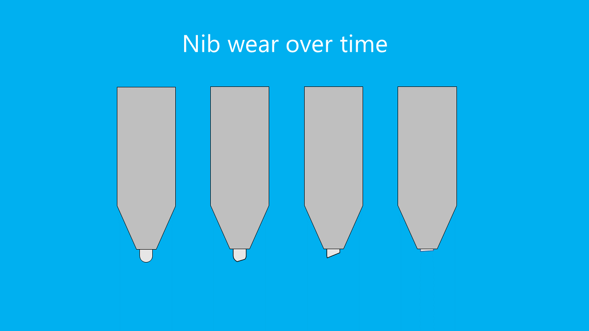
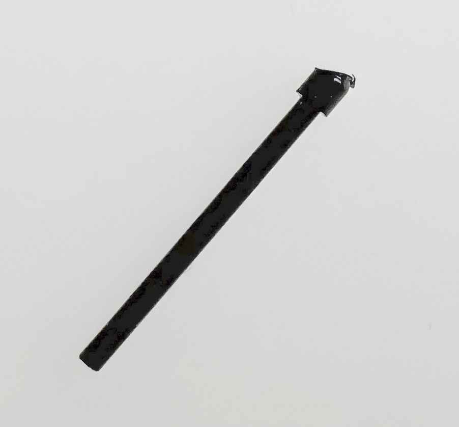
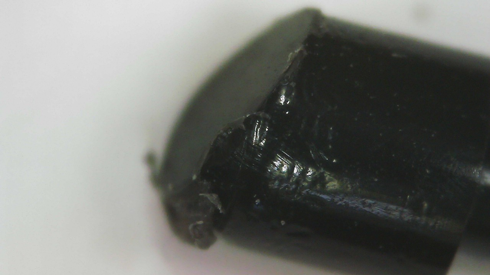
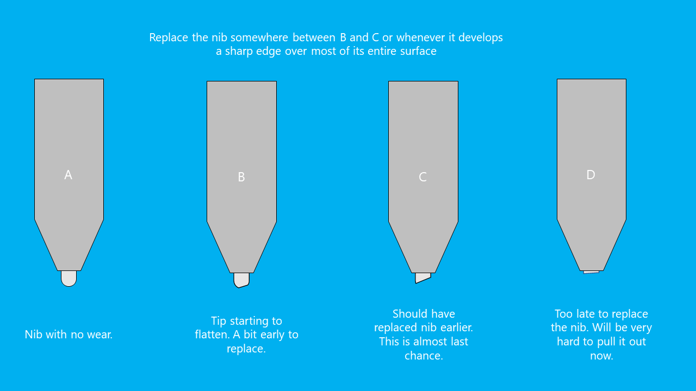

# Nib wear

## Overview

A nib wears down due to friction caused by the nib moving against the tablet surface. **Many factors** influence how fast a nib wears down, and people have **vastly different experiences**. For some people, a nib may last years. Some people seem to go through a nib in a week.

Two changes will be visible in your nibs over time:

* The nib gets shorter
* The nib may flatten out, creating essentially a sharper edge

<figure><figcaption></figcaption></figure>

## Examples

Below you can see the wear on a Wacom Art Pen nib that was used on a Wacom Intuos Pro Large (PTH-860) surface for two weeks.

<figure><figcaption></figcaption></figure>

<figure><figcaption></figcaption></figure>

## Surface texture

Tablets vary in the amount of surface texture they have. The more texture, the more likely the nib is to wear down. More here: [Surface texture](../../core/surface-texture.md).

The nib wears down as you use it on a tablet surface. But a plastic tablet surface can also wear down from repeated exposure to the nib. As a result, the tablet surface can become smoother over time. So even if the texture is eating through your nibs at first, it may affect them less later on. More here: [Surface wear on pen tablets](surface-wear-pen-tablets.md)

## Heavy-handed drawing

Some people draw "heavy-handed" and put a lot of pressure on their nib. This will increase the friction and the rate at which the nib wears down.

## Many fast strokes

Some people have a drawing style that uses lots of strokes over and over. For example, they might fill in an area by drawing hundreds of cross-hatched lines. This can accelerate nib wear.

## Nib material affects nib wear

Nibs are typically made of plastic or felt. The material choice affects how fast the nib wears down. For example, felt nibs wear down faster than plastic nibs. More here: [Nib material](../../core/nib-material.md).

## Preventing or slowing nib wear

* Try drawing with less pressure. You can change the pressure curve in your driver to help lessen the need to press down so hard.
* If you are doing a lot of back and forth strokes to fill in an area, that repeated motion of the pen can wear down the nib fast. Consider using some other way of filling in an area.
* Some tablets like the Wacom Intuos Pro have replaceable **texture sheets**. In Wacom's case there are three texture styles: standard, smooth, rough. Try the smooth texture sheet.
* I do NOT recommend [Using metal nibs](../customizing/metal-nibs.md).

## When should you replace your nib?

I recommend replacing your nib when either of these conditions is true:

* Most of the tip has become flat
* The nib is getting short. Nib remover tools need to be able to grasp enough of the nib to pull it out. If you let it get too short, it may become stuck or very difficult to remove.

<figure><figcaption></figcaption></figure>

## Resources

Here are some videos related to this topic:

* Xencelabs - [When Do I Need to Change The Nib on My Pen?](https://www.youtube.com/watch?v=s7n0Sene2SQ) Oct 20, 2025
* Mink - [Tips for increasing your Pen Nibs’ lifespan](https://youtu.be/t2nJ4k4YJl0) Jul 9, 2021
* Aaron Rutten - [When to CHANGE Drawing Tablet Pen Nibs](https://youtu.be/iI6X41Jhm9g) Dec 25, 2020
* Aaron Rutten - [Wearing Down Nibs & Tablet Scratches](https://youtu.be/Ws_gXgdmKX0) Feb 27, 2015
