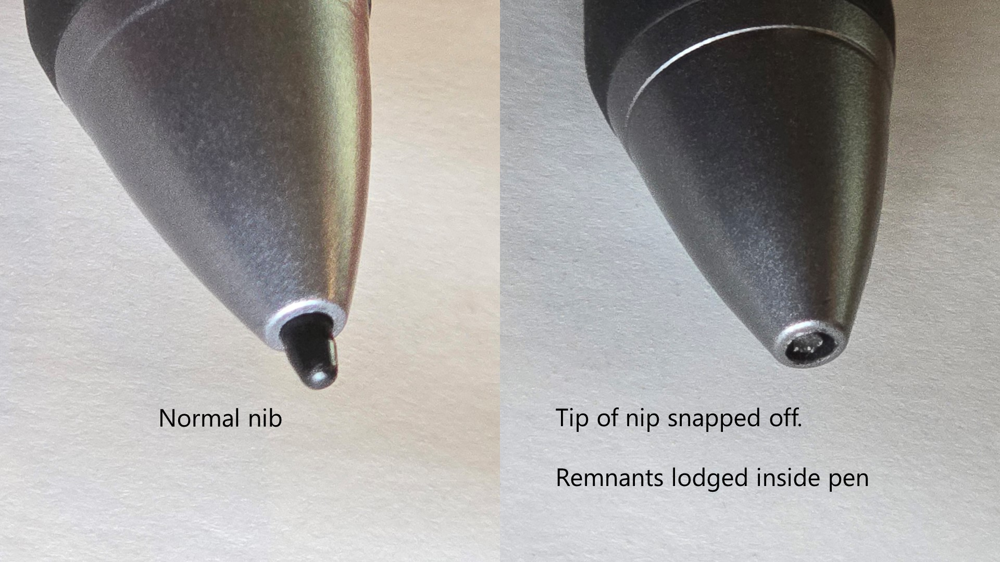

# Removing a broken nib

## Overview

If the nib is broken in half and stuck deeply inside or there's not enough of it to grip then normal techniques may not get it out.

Here are some other options.

<figure><figcaption></figcaption></figure>

## OPTION: Precision tweezers

I used this iFixit set of precision tweezers. Specifically I used the one in the middle. I wasn't able to put both both ends into the pen. Instead, I put one end into the pen and pressed against the side of the nib to slowly pull the nib out a little bit at a time. Once enough was out, I used the tweezers normally to pull the nib out.

<figure><figcaption></figcaption></figure>

## OPTION: The hot glue method

This method involves using a glue gun. Roughly the steps are:

* put a very tiny amount of hot glue on the end of a toothpick
* Then keep the toothpick touching the nib inside the pen for a minute as the glue cools
* then pulling the toothpick which should hopefully cause the nib to come out

You've got to be careful to not get glue stick inside the pen.

## OPTION: The hot needle method

Stick a heated needle into the nib and when the plastic of nib cools, pull it out. Some people suggest combining this technique with glue on the needle tip. <mark style="color:red;">**Use this option with great caution. People have ruined their pens and made the problem worse with this hot needle technique.**</mark>

## Reddit threads:

* ([https://www.reddit.com/r/huion/comments/1104oj6/help\_ive\_broken\_my\_stylus\_nib\_is\_there\_a\_way\_to/](https://www.reddit.com/r/huion/comments/1104oj6/help_ive_broken_my_stylus_nib_is_there_a_way_to/))
* [https://www.reddit.com/r/wacom/comments/73bndc/wacom\_bamboo\_ink\_nib\_broke\_and\_i\_cant\_get\_it\_out/](https://www.reddit.com/r/wacom/comments/73bndc/wacom_bamboo_ink_nib_broke_and_i_cant_get_it_out/)
