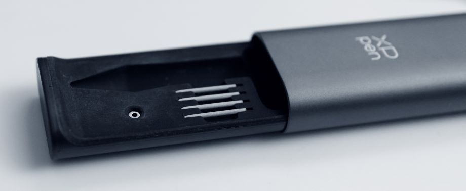
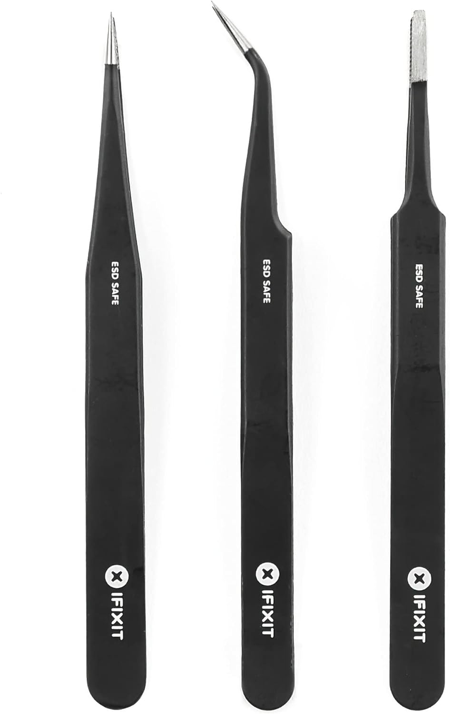

# Removing a nib

## Overview

Removing the nib from the pen is a common maintenance task to deal with nibs that are wearing down and need to be replaced. You may also need to do this in an emergency if the nib is broken.

## Purpose-built nib removers

Your drawing tablet likely came with a nib remover. It is usually either a piece of metal or a metal part of a pen stand.

Here's a simple nib remover.

This pen case has a nib remover (the small metal ring) built in.

<figure><figcaption></figcaption></figure>

## Alternatives to nib removers

**If you don't have a nib remover**, that is not a problem. You can use any tool that can grip the nib. Here are some options:

* Tweezers
* Needle-nose pliers
* Fingernail clippers

## Removing a broken nib stuck in the pen

If the nib is broken in half and stuck deeply inside, or if there is not enough of it to grip, normal techniques may not get it out. Here are some other options.

<figure><figcaption></figcaption></figure>

### OPTION: Precision tweezers

I used this iFixit set of precision tweezers. Specifically, I used the one in the middle. I was not able to put both ends into the pen. Instead, I put one end into the pen and pressed against the side of the nib to slowly pull it out a little at a time. Once enough was exposed, I used the tweezers normally to pull the nib out.

<figure><figcaption></figcaption></figure>

### OPTION: The hot glue method

This method involves using a glue gun. Roughly, the steps are:

* Put a very tiny amount of hot glue on the end of a toothpick
* Then keep the toothpick touching the nib inside the pen for a minute as the glue cools
* Then pull the toothpick, which should hopefully cause the nib to come out

You have to be careful not to get glue stuck inside the pen.

### OPTION: The hot needle method

Stick a heated needle into the nib and, when the plastic of the nib cools, pull it out. Some people suggest combining this technique with glue on the needle tip. <mark style="color:red;">**Use this option with great caution. People have ruined their pens and made the problem worse with this hot needle technique.**</mark>

### Reddit threads about broken nibs

* [r/huion - Help, I’ve broken my stylus nib, is there a way to get the rest of the nib out?](https://www.reddit.com/r/huion/comments/1104oj6/help_ive_broken_my_stylus_nib_is_there_a_way_to/) 2023-09-11
* [r/wacom - Wacom Bamboo Ink nib broke and I can't get it out](https://www.reddit.com/r/wacom/comments/73bndc/wacom_bamboo_ink_nib_broke_and_i_cant_get_it_out/) 2017-09-29

## Videos

#### \[AARON RUTTEN] How to Remove a Completely Worn Nib From Your Drawing Tablet Pen


