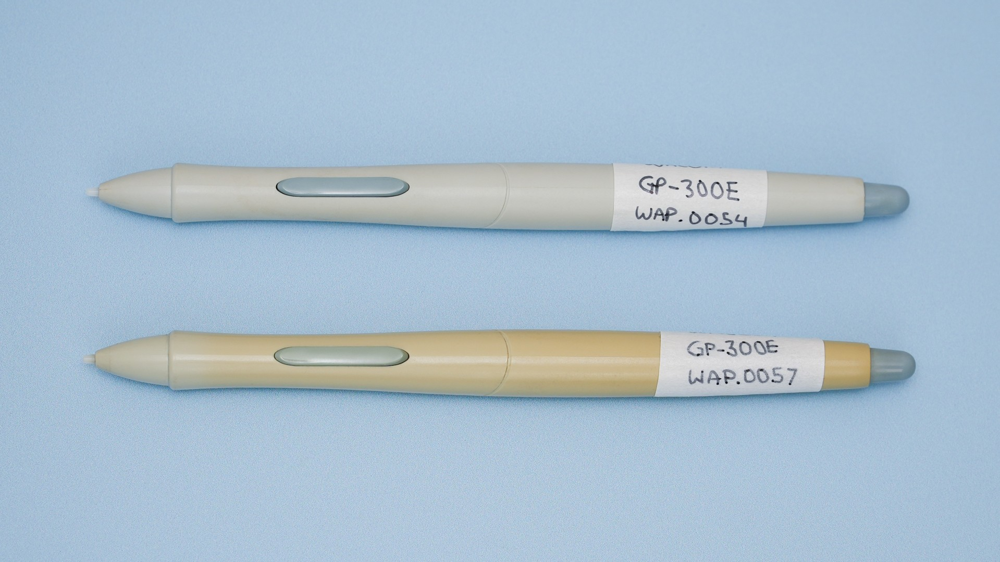

# Retrobright to handle yellowed plastic

## Restoring yellowed-plastic

If you are buying a very old drawing tablet, the plastic may have shifted colors and turned more yellow over time.&#x20;

Below are two Wacom GP-300E pens compared. Both come from the original Wacom Intuos Line released in 1998. The one on top has a typical look of the pen when it was released. The one on the bottom exhibits moderate yellowing.  &#x20;

<figure><figcaption>
Two Wacom GP-300E pens compared. 
</figcaption></figure>

This color change may be be reversed or reduced through a process is called **retrobright.**

The video below provides clear instructions on how to perform the retrobright process.&#x20;



## Resources
