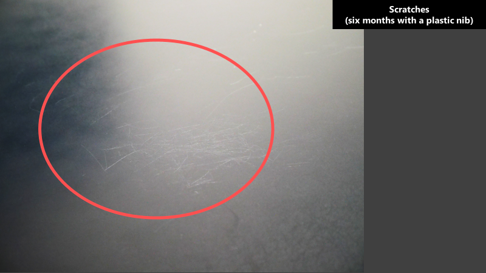
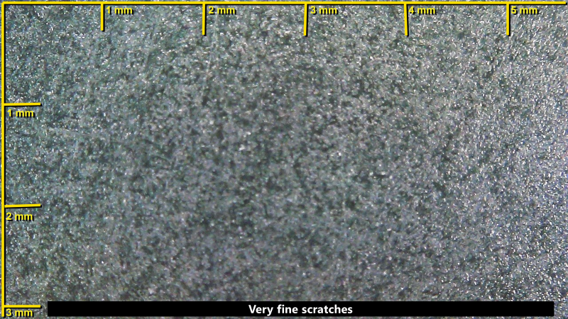
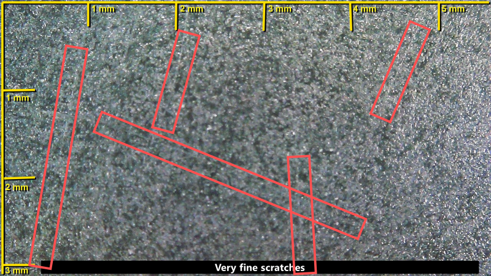
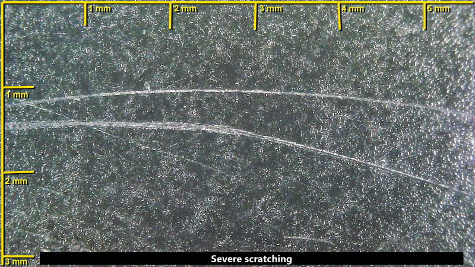
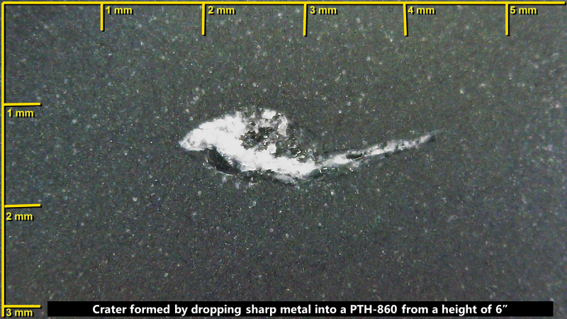

# Scratches on pen tablets

## Overview of surface wear on pen tablets

Scratches are a form of permanent damage. Depending on how deep the scratch is, it can affect your drawing experience. For more examples of surface wear and how to minimize it, go here: [Surface wear on pen tablets](surface-wear-pen-tablets.md).

Below is an example of some scratches that, while ugly, do not interfere with the drawing experience. Small scratches can also be hard to see sometimes and are greatly affected by lighting conditions.

Some of what you see is also a false scratch. See [False scratches](false-scratches.md).

<figure><figcaption></figcaption></figure>

As you can see the scratches can be very small. These kinds of scratches will not affect your drawing experience.

Here is a close-up view through a microscope:

<figure><figcaption></figcaption></figure>

<figure><figcaption></figcaption></figure>

Deeper and larger scratches are also possible. This can definitely affect your drawing experience.

<figure><figcaption></figcaption></figure>

## Extreme damage

Dropping sharp objects onto the surface of a pen tablet can cause severe damage. The crater below was formed by accidentally dropping scissors from a height of about 6 inches above the pen tablet.

<figure><figcaption></figcaption></figure>
