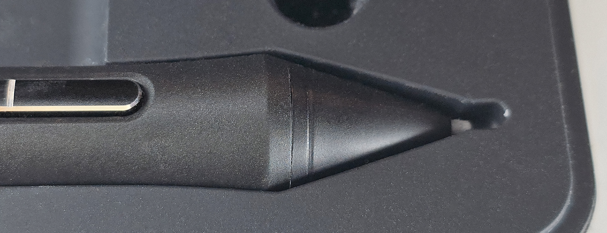
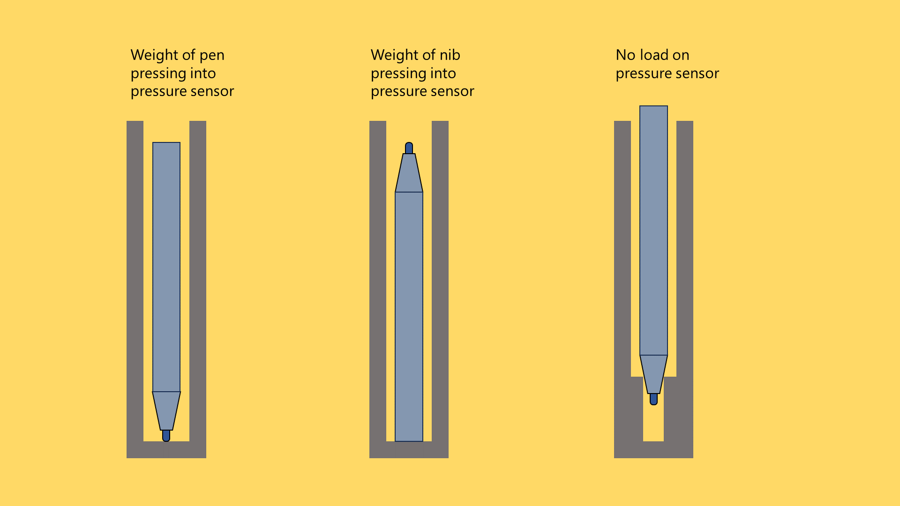

# Storing your pen

## Overview

Store your pens so that the nib is not experiencing constant pressure. Some tablet users suggest that if the nib has a constant pressure applied to it, over time the pressure could damage the pressure sensor.

## Pen case

If your pen came with a case designed for it, that is the safest place to store it. These cases provide a lot of protection for the entire pen and the pressure sensor.

In the photo below you can see how a case has extra room for the nib so nothing can press into it.

<figure><figcaption></figcaption></figure>

## Vertical options

Below are three ways to store a pen vertically.

* The one on the far right places no load on the pressure sensor
* The one on the far left places the entire weight of the pen on the pressure sensor
* The one in the middle places only the weight of the nib on the pressure sensor. This is the way I store my pens.

<figure><figcaption></figcaption></figure>
