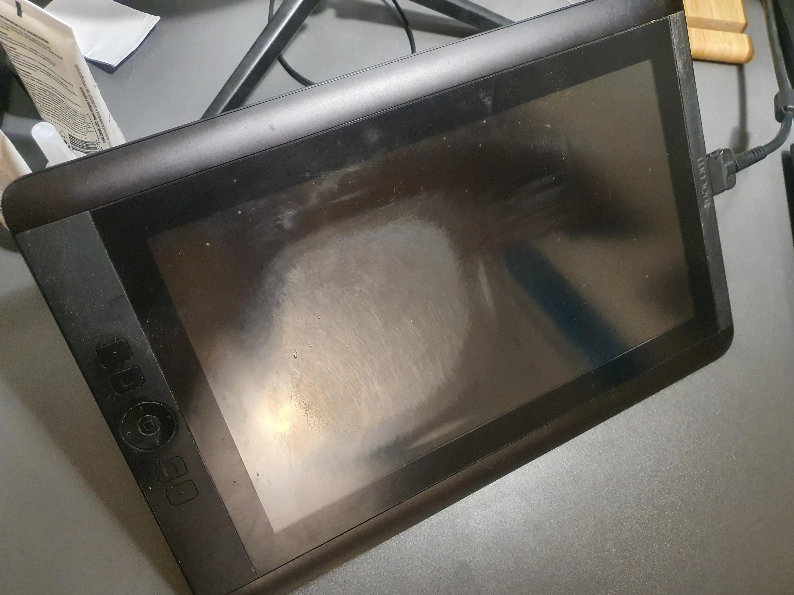

# Surface wear on pen displays

## Background

Pen displays (tablets with a screen) come in two varieties:

* Those where your pen makes direct contact with the glass surface. Typically, these tablets have an "etched glass" surface. See [Etched glass](../pen-displays/etched-glass.md).
* Those where your pen is touching a protective film covering the glass and so the pen does not touch the glass directly.

These surfaces wear differently and show wear differently.

## Wear on etched glass

Etched glass used for a pen display is highly durable. It is designed to be drawn on directly with the pens and nibs that the manufacturer supplies. However, it is not infinitely resistant to damage from various sources. Different etched-glass treatments may also have different levels of hardness.

## Real-world examples

### Example of durability

See this video by David Revoy who is testing the Kamvas Pro 19: [https://www.youtube.com/watch?v=M9VbiVJX-J4](https://www.youtube.com/watch?v=M9VbiVJX-J4)

At 3:32 he performs a scratch test. He tries to deliberately scratch the glass with:

* his car keys
* a small piece of metal
* a hobby knife

His attempts leave some kind of metallic-looking residue on the glass which he can clean off revealing the surface is not scratched.

### Counterexamples

On the internet — Reddit, eBay, and elsewhere — you can find plenty of people who have accidentally scratched the glass of their tablet, including the Kamvas Pro 19. Sometimes these scratches do not happen while drawing, but during other moments when something makes contact with the tablet, perhaps with more force. Some tablets also show scratches from typical use.

Below is a picture of a Wacom Cintiq 13 HD, which has an etched glass surface. It exhibits a lot of wear. I think this is a relatively uncommon and extreme amount.

From this Reddit post: [https://www.reddit.com/r/wacom/comments/zv593v/does\_cintiq\_13hd\_have\_screen\_protection\_see\_coment/](https://www.reddit.com/r/wacom/comments/zv593v/does_cintiq_13hd_have_screen_protection_see_coment/)

## Preventing damage to glass

### Small particle damage

Some people suggest that small particles of various materials can land on the glass or attach themselves to the nib. They also suggest that, as you draw on the glass, scratches may be caused not by the pen or nib itself, but by those particles being dragged across the surface.

I cannot say that I have experienced this myself. But I do think it is in your best interest to keep the surface of your pen display and your pens clean.

### Contact with objects on your hand

Some artists are very careful to remove anything metallic from their hands or wrists when they draw. I think this is a reasonable way to avoid potentially damaging the glass.

### Scratches during transport

If you are transporting your pen display, make sure the glass is covered by something that protects it during the trip. I have seen people mention putting a pen display in a backpack, only for another object inside the backpack to make contact with the glass and damage it.

## Screen protectors

Screen protectors on top of the tablet glass naturally protect the glass from damage. One benefit is that, if they do get damaged, you can generally replace them.

More: [Screen protectors](../../catalog/accessories/surface-protectors/screen-protectors/)

## Glass damage is permanent

The glass surface of a pen display is not designed to be removed. In fully laminated pen displays, the glass is bonded to the display panel with a layer of optically clear adhesive (OCA). In short, the glass you have is going to be there forever.

Any wear or damage you cause to the glass will also be there forever.

I have never seen anyone find a way to remove damage from the glass surface.

## My experience

I have never scratched the glass of any of my 30+ pen displays - except for the Wacom Movink 13 (DTH-135) which has some kind of AF coating which is known to be "soft" and easily damaged.
