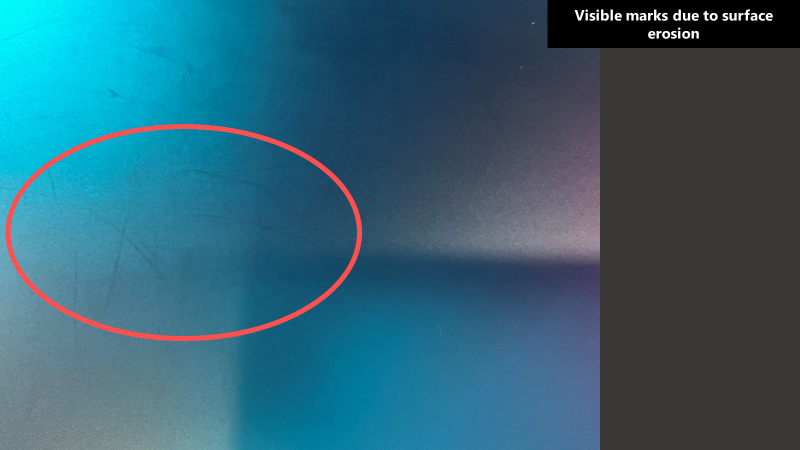
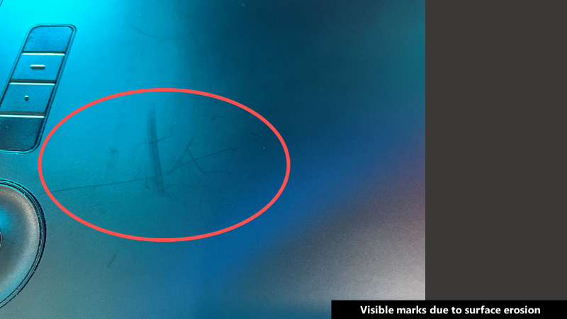
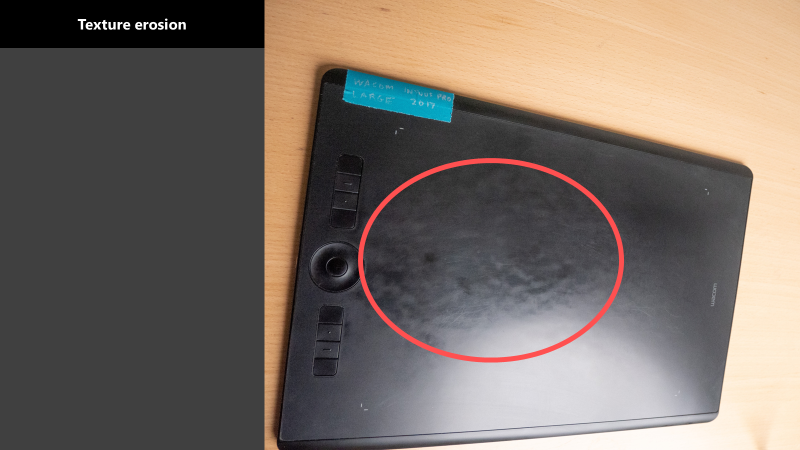
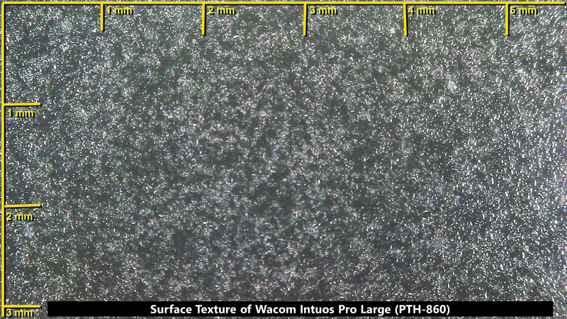
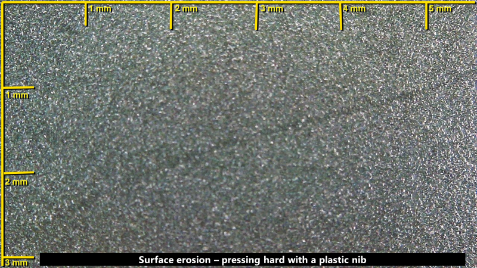
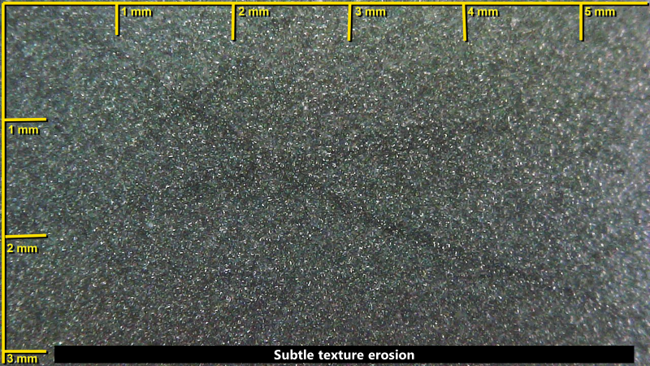
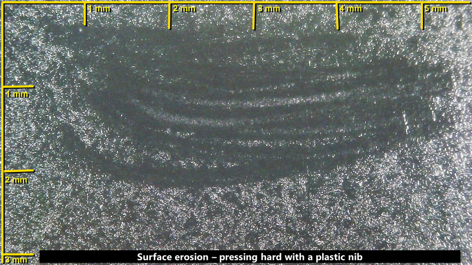

# Texture erosion on pen tablets

## Overview

The surfaces of a pen tablet usually have some texture applied to prevent drawing on them from feeling "slippery."

Tablets vary quite a bit in how much texture is on them. The Intuos Pro models (PTH-460, PTH-660, PTH-860) are known for having a lot of texture.

As you drag your pen on the surface, you will eventually notice two forms of texture erosion:

* thin or thick marks
* broad areas where the texture has been worn off

For more examples of surface wear and how to minimize it, go here: [Surface wear on pen tablets](surface-wear-pen-tablets.md).

## Examples

These texture erosion marks can be very difficult to see. Depending on the lighting, they may be invisible, lighter than the texture color, or darker than the texture color.

<figure><figcaption></figcaption></figure>

Some texture erosion marks are not even caused by the pen. Other objects that come in contact with the tablet can cause them. You can often detect these because they produce much wider marks than the pen can produce.

<figure><figcaption></figcaption></figure>

Here is an example of broad area texture erosion on a Wacom Intuos Pro PTH-860. The overall area can be uniformly smooth/shiny or smooth/shiny in patches.

<figure><figcaption></figcaption></figure>

Here is a close-up example of the texture of a Wacom Intuos Pro Large (PTH-860).

<figure><figcaption></figcaption></figure>

<figure><figcaption></figcaption></figure>

The texture erosion can be very subtle.

<figure><figcaption></figcaption></figure>

Below is an example of deliberately trying to erode the texture over a wide area by moving the pen back and forth over an area. Notice how much of the texture is gone.

<figure><figcaption></figcaption></figure>

### Impact of texture erosion

Texture erosion is typically benign. While it is unattractive and sometimes visible, it does not deflect the tip of the pen.

### More examples of texture erosion

[https://www.reddit.com/r/wacom/comments/144a6lk/is\_my\_wacom\_intous\_pro\_m\_okay/](https://www.reddit.com/r/wacom/comments/144a6lk/is_my_wacom_intous_pro_m_okay/)
