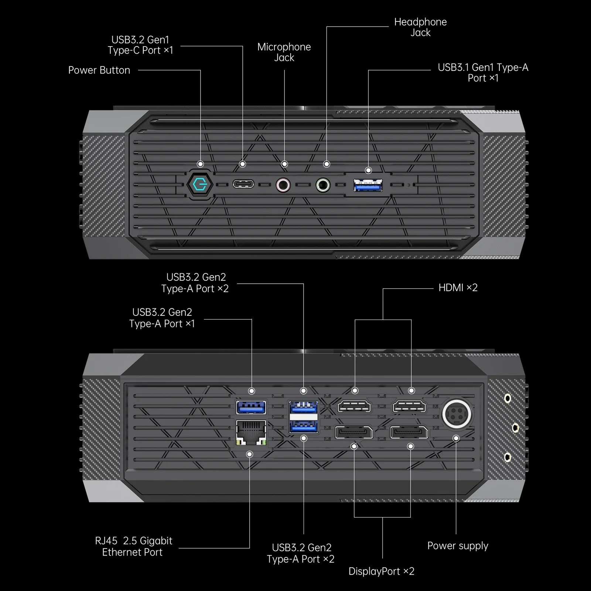

# 7P notes: Minisforum Neptune HX99G

## Overview

As my primary desktop for "work" and for creating videos  and doing art, I use a Minisforum Neptune HX99G that I bought in sale for $1,000 (normally is $1500).

## Photos

These photos are from Minisforum. This is exactly how mine looks with one exception. Instead of 2 DisplayPort ports on the back, mine has two USB4 ports.

<figure><figcaption></figcaption></figure>

<figure><figcaption></figcaption></figure>

## Specs

This PC is available in several configurations. Below is the configuration of the one I bought.

* Model: HX99G
* CPU: AMD Ryzen 9 6900HX
  * 8 Cores/16 Threads
* RAM: 64GB
* Storage: 1TB SSD
* GPU: AMD Radeon RX 6600M
* Back I/O:
  * 2x HDMI ports
  * 2x USB4 ports&#x20;
    * Dome versions of the HX99G have 2x DisplayPort ports instead of USB4
  * 3x USB 3.2 Gen2 Type-A ports
  * 1x USB3.2 Gen2 Type-A port
  * RJ45 2.5 Gigabit ethernet port
* Front I/O:
  * Microphone jack
  * Headphone jack
  * 1x USB 3.1 Gen1 Type-C port
  * 1x USB 3.1 Gen1 Type-A port

## Connections

* one USB4 port is connected to a 43" 4K monitor via thunderbolt 3 cable
* one USB4 port is has an 2 foot UseBean USB-C Extension cable ([amazon](https://www.amazon.com/dp/B0BB13ZNPQ)) that runs from the back to the front. This makes it very easy for me to try out different pen displays.
* one of the USBA ports on the back leads to 8 port USB hub placed near . This makes it easy for me to try different tablets and other devices
* One of the HDMI ports is connected to a 32" monitor
* I have it connected to a Rode RODECaster Duo for audio recording
* I typically have it connnected to 3 displays simultaneously (2 monitors, and 1 pen display).
  * Although it can handle 4 separate displays, I've only used it that way very rarely.

## How I use it

This is my every day “work” PC. All my major tasks are performed on this PC. These tasks include:

* Creating my YouTube videos. This involves recording audio. Writing scripts. Creating PowerPoint slides. And audio and video editing.
* Writing documents that I published my website
* Creating artwork - mostly with clip studio paint and Krita
* Photoediting - with Photoshop and Affinity Photo
* Writing code using Visual Studio
* I have not tried gaming on this PC.

## Stability

VERY GOOD.

In the year I've been using it, there have been 2 times it froze up and required me to restart.

Occasionally when I am watching a YouTube video and I am doing something it can cause some stuttering for about 2 seconds and then goes back to normal. I don't know what the cause is, and it happens only about once a month.

## Performance

For my needs has been excellent. I don't honestly feel like it has restricted me in any way to switch from a full desktop to this minipc.

## Noise

Essentially silent. You would have to put your ear right next to the device to hear a slight hum.

Every now and then when I am exporting a video I might hear the fans ramp up loudly. But otherwise, I consider this mini-pc completely silent.&#x20;

## Why did I switch to this Mini PC

There were several reasons

* I was looking for something **quiet** - **silent** if I can get it.
* I wanted something more portable. I like rearranging my workspace a lot. The idea was to place a mini-pc on a desk that has casters. I keep the minipc on my desk and this lets me essentially roll the entire desk that carries my entire workspace into different places in my house.

## Other options I tried

I had tried a Microsoft Surface Pro 8 to serve the role of a Mini-PC. This worked overall well, however:

* The Surface Pro -  for no clear reason- would randomly start aggressively spinning its fans **loudly**.&#x20;
* The Surface Pro didn't support as many connected displays as I wanted.
* The performance was OK but I felt it struggled when editing videos
* Only a few I/O options - even when used with the Microsoft Surface Dock

## What could be better

* I am looking forward to the possibility of ARM processors in mini-pcs. This might give me even more power with even less power consumption and fan noise.
* I wish the stuttering I mentioned earlier did not happen. It's a minor irritation and only sometimes occurs for a few seconds, but it does mar an otherwise excellent experience.

&#x20;

