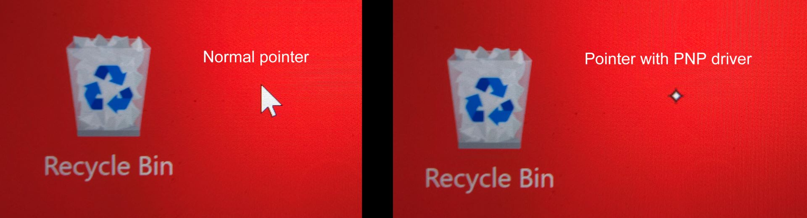

# Windows PNP support

## Introduction

Microsoft Windows includes built in drivers for many devices. A great example are mice. You plug them in and they just work. This is why these drivers are called “plug-and-play” or P\&P drivers.

And windows has PNP drivers for drawing tablets. Sometimes these PNP drivers are very useful. But you should keep in mind that these PNP drivers are missing a lot of features that you really need to have.

Windows PNP drivers are useful in some cases:

* You intend to use the drawing tablet as a mouse replacement. So you're not drawing you're just pointing and selecting and clicking
* You need to troubleshoot problems with the manufacturer's tablet drivers.
* You need to use them as a last resort if you're manufacturers tablet drivers aren't working.

The key things you should know

* Not all tablets work with Windows PNP tablet drivers
* The drivers are extremely limited in what they can do.
* In my opinion they may work better with pen displays than pen tablets that don't have a screen. This is due to some missing features.

## Feature support

* **pressure sensitivity** - PNP drivers do support this.
* **tilt sensitivity** - PNP drivers support this&#x20;

## Limitations&#x20;

There are a large set of limitations that come with windows PNP mode compared to manufacturer tablet drivers.

* You cannot control how to map the active area of your tablet to a display in any way
  * This means that mismatched aspect ratios for pen tablets which will result in distortion when drawing. More here explaining what this means: [Matching aspect ratios with Force Proportions](../../customizing/force-proportions.md)
* You cannot control what the buttons on the pen does.
* You cannot control what the buttons on the tablet do.&#x20;

## Forcing Windows to use PNP drivers

* Uninstall your manufacturer's tablet driver
* Restart your computer.

When you computer starts back up it should be using the PNP drivers.

## Is your tablet using PNP drivers with your tablet?

The easiest way to see if this how Windows is interacting with your tablet is to look at the system pointer.

Normally your pointer will look like this when you are using the mouse or when you have a tablet driver installed.&#x20;

<figure><figcaption></figcaption></figure>

(NOTE: It's hard to do a screen capture of this pointer, so I had to rely on a phone camera)

## When should you use PNP drivers?

If your manufacturer tablet driver is having problems, the PNP drivers may be a "last resort".

## Using PNP mode for testing and diagnosing problems

If you are having problems with your tablet, trying PNP mode can be a good diagnostic test to help identify if the problem is related to the manufacturer tablet driver or not. More here: [DIAG: Testing with Windows PNP drawing tablet drivers](../../../troubleshooting/diag-testing-with-windows-pnp-drawing-tablet-drivers.md)&#x20;

## Interactions between tablet drivers and PNP mode

When you install a tablet driver, basically the tablet driver takes over handling the tablet and windows no longer uses its PNP mode.

And so the PNP mode will not affect you anymore.

Every now and then I have windows use PNP mode even though a driver is installed. Typically this seems to happen when:

* Windows is starting up and the tablet driver hasn't been started yet. For a little bit of time maybe a few seconds maybe 30 seconds you might see the PNP mode cursor. But then the tablet driver will start and it will go back to normal. I might see this happen once or twice a year on my windows machines
* Sometimes when the tablet driver is having problems working with windows then you might see the PNP mode being used. &#x20;

## Which tablets are compatible with Windows PNP?

See this: [Windows PNP driver compatibility testing](windows-pnp-driver-compatibility-testing.md).

## Notes

Windows supports PNP for lots of devices. For example mice or monitors. PNP is not limited to just tablets.&#x20;

##

