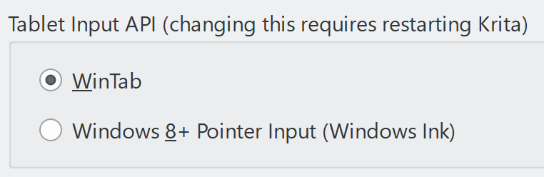
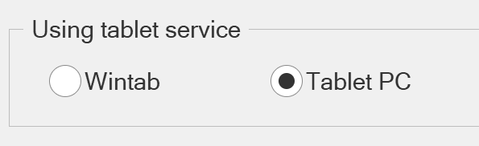
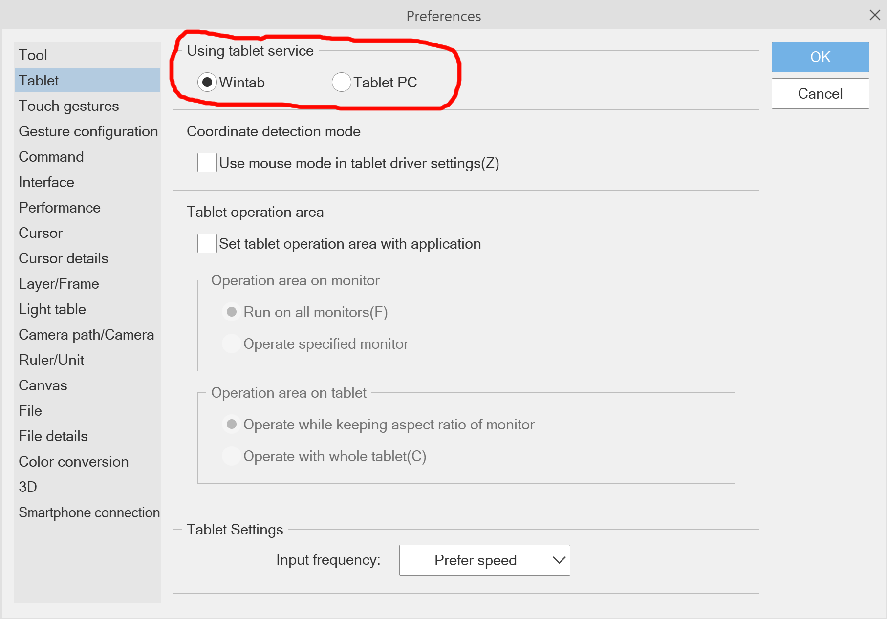
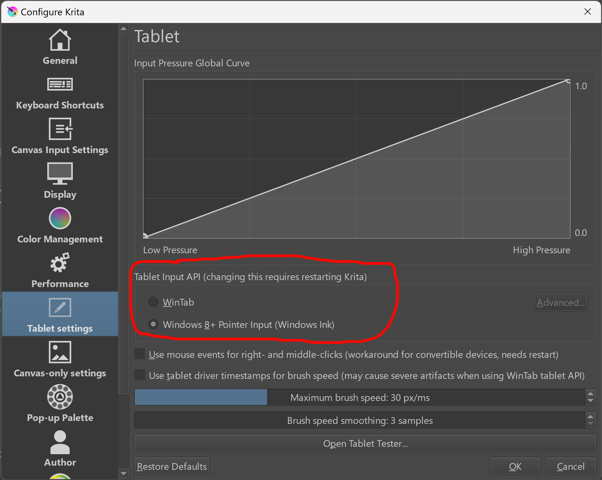
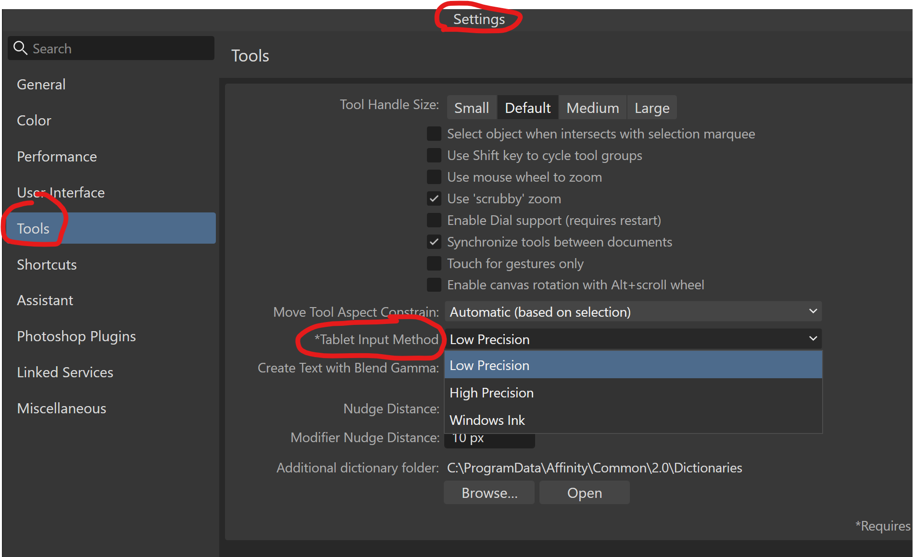
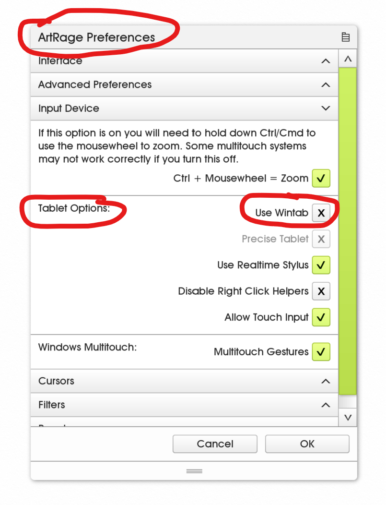

# Configure Windows Ink for apps

## The user experience

Apps vary in how they present the configuration for Windows Ink vs WinTab .

Apps may present it like this (Krita is shown). Notice that some apps use the phrase like "Windows 8 pointer API" to mean "Windows Ink"

<figure><figcaption></figcaption></figure>

Other apps may use the phrase "Tablet PC"

<figure><figcaption></figcaption></figure>

## Clip Studio Paint

* Open Clip Studio Paint
* Go to **File** > **Preferences** > **Tablet**
* In the **Tablet Input API** section, you can choose to enable or disable Windows Ink
  * choose **Wintab** to enable Windows Ink
  * or choose **Tablet PC** to disable Windows Ink
* Once you've made the change, restart Clip Studio Paint

## Krita

* Open Krita
* Go to **Settings** > **Configure Krita** > **Tablet settings**
* In the **Tablet Input API** section:
  * Choose **Windows 8+ Pointer Input (Windows Ink)** to enable Windows Ink
  * or Choose **WinTab** to disable Windows Ink
* Once you've made your change, restart Krita.

## Adobe Photoshop

See these instructions: [Configuring Photoshop to NOT use Windows Ink](winink-photoshop.md)

## Affinity Photo and Affinity Designer

* Navigate to **Edit > Settings > Tools > Tablet Input Method**
* There are three options there:
  * **Low Precision** (this is the default value)
  * **High Precision**,
  * **Windows Ink**
* Restart Affinity Photo/Designer once you change this setting.

<figure><figcaption></figcaption></figure>

## ArtRage Vitae

* Navigate to **Edit > ArtRage Preferences > Input Device > Tablet Options > Use Wintab** checkbox.
* Set the checkbox as you need
  * CHECKED -> enable Windows Ink (it is checked by default)
  * UNCHECKED -> disable Windows Ink
* Restart ArtRage once you change this setting.

<figure><figcaption></figcaption></figure>

## Firealpaca

* In **FireAlpaca**, navigate to **File > Brush Environment Settings**
* To the right of Select Pen Pressure API choose an option
  * **Touch PC + Pen Tablet (Wintab)** -> disable Windows Ink
  * **PC + Pen Tablet (Wintab)** -> disable Windows Ink
  * **Tablet PC** -> use Windows Ink
* **Brush Preference Settings**

## Medibang Paint

* In MediBang, navigate to **File > Prefs and Settings > Brush Preference Settings**
* Set the **Validate native OS pen pressure detection**
  * CHECKED -> enable Windows Ink (it is checked by default)
  * UNCHECKED -> disable Windows Ink
* Click **OK**
* Restart Medibang

## Rebelle

* in Rebelle go to **Edit** > **Preferences** > **Tablet**
* Under Tablet Options you can pick whether Windows Ink is used:
  * **Wacom compatible (WinTab)** -> disable Windows Ink
  * **Xencelabs tablet** -> unknown (i need to research)
  * **Windows Pointer Device** -> unknown (I need to research)
  * **Windows Ink Compatible** -> enable Windows Ink

## Other applications

Many other apps covered here: [https://opentabletdriver.net/Wiki/FAQ/WindowsAppSpecific](https://opentabletdriver.net/Wiki/FAQ/WindowsAppSpecific)

This list includes

* Photoshop CC
* Paint Tool SAI 2
* Corel Painter
* Rebelle
* Affinity Photo and Affinity Designer
