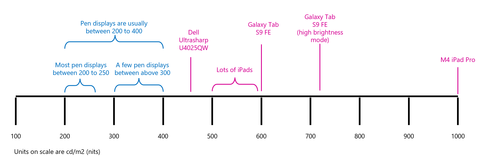

# Brightness

## Overview

Drawing tablets with embedded display panels have a maximum typical brightness. You have been exposed to many display panels in televisions, phones, and watches. Here I'd like to set your expectations for brightness on drawing tablets.

## Measurement

Brightness is measured in cd/m2 ([candela per square meter](https://en.wikipedia.org/wiki/Candela_per_square_metre)), but that is hard to type, so many people use the equivalent unit of **nit**.

## Lighting conditions

The environment you use the tablet in greatly affects the brightness you need. Below is my take on what you need under different conditions.

| Environment                | Notes                                                                                                                                                                                                              |
| -------------------------- | ------------------------------------------------------------------------------------------------------------------------------------------------------------------------------------------------------------------ |
| **indoors + dark**         | 
Low amounts of ambient light. Light conditions are not changing.
<ul><li>200 to 250 nits is enough</li></ul>                                                                                                 |
| **indoors + bright**       | 
Lots of ambient light. Maybe due to bright indoor lights. Maybe due to windows. If there is a window, brightness may change dramatically because of cloud cover.
<ul><li>250 to 350 nits is enough</li></ul> |
| **outdoors + under shade** | 
Overall bright environment with lots of ambient light. No direct sunlight hits your tablet.
<ul><li>>=500 nits are needed</li></ul>                                                                          |
| **outdoors + no shade**    | 
Very bright. Sunlight hits your tablet.
<ul><li>>=1000 nits are needed</li></ul>                                                                                                                             |

## What you can expect from drawing tablets

Overall, display panels for drawing tablets fall in the range of 200 to 400 nits.

* Many are within the range 220 to 250 nits.
* Only a few are >= 300 nits.

<figure><figcaption></figcaption></figure>

## Distribution of brightness values

Here is the distribution of brightness values for pen displays released in 2020 or later.

<table><thead><tr><th width="156">Brightness</th><th>Count</th></tr></thead><tbody><tr><td>400</td><td>2</td></tr><tr><td>350</td><td>1</td></tr><tr><td>330</td><td>1</td></tr><tr><td>320</td><td>1</td></tr><tr><td>300</td><td>2</td></tr><tr><td>275</td><td>1</td></tr><tr><td>250</td><td>9</td></tr><tr><td>220</td><td>16</td></tr><tr><td>210</td><td>1</td></tr><tr><td>200</td><td>3</td></tr></tbody></table>

## Top 10 brightest pen displays

Includes only pen displays released since 2020.

<table><thead><tr><th width="460">Pen Display</th><th>Brightness</th></tr></thead><tbody><tr><td>WACOM Cintiq Pro 17 (DTH-172)</td><td>400</td></tr><tr><td>WACOM Cintiq Pro 27 (DTH-271)</td><td>400</td></tr><tr><td>WACOM Movink 13 (DTH-135)</td><td>350</td></tr><tr><td>XENCELABS Pen Display 24 (LPH2412U-A)</td><td>330</td></tr><tr><td>WACOM Wacom One 13 touch GEN2 (DTH-134)</td><td>320</td></tr><tr><td>WACOM Cintiq Pro 16 (2021) (DTH-167)</td><td>300</td></tr><tr><td>HUION Kamvas Pro 27 (GT-2701)</td><td>300</td></tr><tr><td>WACOM Wacom One 12 GEN2 (DTC-121)</td><td>275</td></tr><tr><td>XPPEN Artist 22 GEN2 (CD220F)</td><td>250</td></tr><tr><td>XPPEN Artist 24 FHD (CD240F)</td><td>250</td></tr></tbody></table>

## Fan noise

A few tablets — only Wacom as far as I know — have fans. These fans help keep their brighter displays cool. The fan noise can be disturbing for some people. For others, it does not matter.
