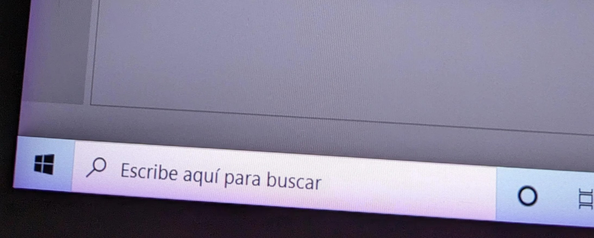

# Color tint on edges of display

Some pen displays exhibit a color tint at the edges of the display. Often it is a purple or lilac color. Some devices exhibit it as a yellowish or orange color. Is NOT pixelated or rough - has very smooth look.

<figure><figcaption></figcaption></figure>

Unlike backlight bleed, the tint is often visible even on a very bright or pure white background

<figure><figcaption></figcaption></figure>

The tint is greatly exaggerated in these diagrams. In reality in can be very subtle.

<figure><figcaption></figcaption></figure>

Keep in mind the topic being discussed here is when the tint as at the edges, not when the tint is evenly distributed over the entire display.

<figure><figcaption></figcaption></figure>

## Examples

<figure><figcaption></figcaption></figure>

## Cause

Based on what I have read the cause due to laminated displays (see: [**lamination**](lamination.md)).

Laminated displays have a layer of optically clear adhesive (OCA) between the glass and the display.

Apparently, pressure at the edges of the display causes this effect in the OCA layer.

## Prevalence

Overall it is uncommon.&#x20;

It is present in NONE of the display devices I have that are laminated.

## Manufacturer pages

* Huion: [https://support.huion.com/en/support/solutions/articles/44002336996-how-to-adjust-color-difference-on-the-edge-of-your-tablet-by-importing-the-new-color-gamut-file-windo](https://support.huion.com/en/support/solutions/articles/44002336996-how-to-adjust-color-difference-on-the-edge-of-your-tablet-by-importing-the-new-color-gamut-file-windo)&#x20;

## Links

* [https://www.reddit.com/r/huion/comments/10i3ftd/purple\_edges\_on\_my\_kanvas\_24\_plus/](https://www.reddit.com/r/huion/comments/10i3ftd/purple\_edges\_on\_my\_kanvas\_24\_plus/)&#x20;
* [https://www.reddit.com/r/huion/comments/vo3o5m/bought\_a\_kamvas\_pro\_16\_25k\_local\_retailer\_says\_it/](https://www.reddit.com/r/huion/comments/vo3o5m/bought\_a\_kamvas\_pro\_16\_25k\_local\_retailer\_says\_it/)  &#x20;
* [https://www.reddit.com/r/4kTV/comments/zt6kf2/sony\_purple\_edges/](https://www.reddit.com/r/4kTV/comments/zt6kf2/sony\_purple\_edges/) &#x20;

