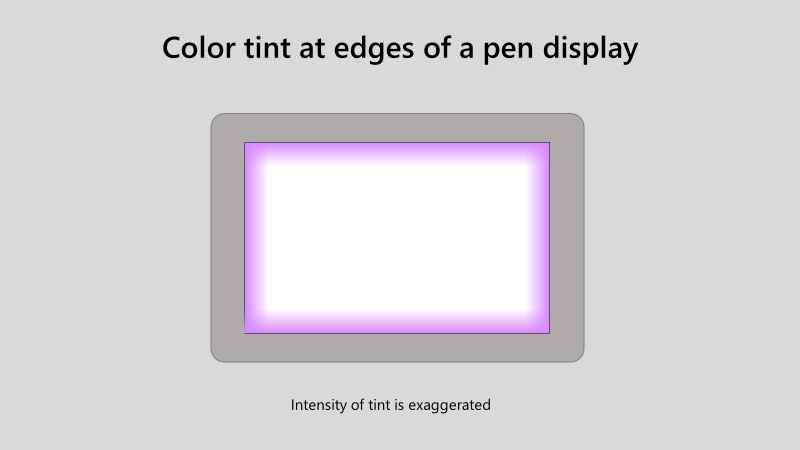
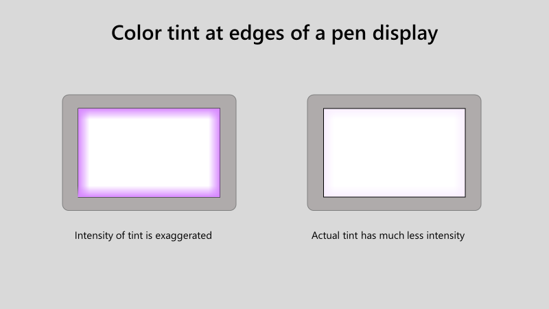
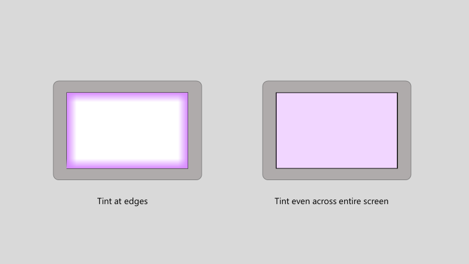
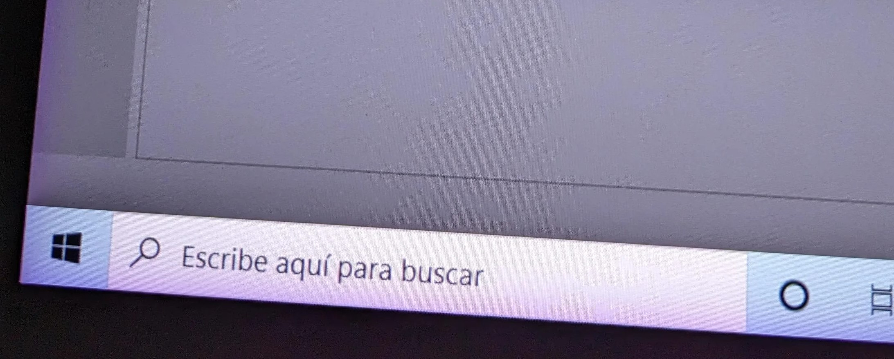

# Color tint on edges of display

## Overview

Some pen displays exhibit a color tint (purple/lilac or yellow/orange) at the edges of the display.&#x20;

Characteristics:

* The tilt Is NOT pixelated or rough. It has very smooth look.
* Often seen on all four edges. I can't think of any examples on only a three or less edges
* Can be very faint.&#x20;
* You may notice it only when when colors on the screen are bright.
* May appear when you first use your tablet, or develop much later. Out of 30+ pen displays, I have one display (Huion Kamvas 22 Plus) that developed a slight purple edge tint 3+ years after I bought it.

## Appearance

<figure><figcaption></figcaption></figure>

The tint is greatly exaggerated in these diagrams. In reality in can be very subtle.

<figure><figcaption></figcaption></figure>

Keep in mind the topic being discussed here is when the tint as at the edges, not when the tint is evenly distributed over the entire display.

<figure><figcaption></figcaption></figure>

## Examples

<figure><figcaption>
Notice that the purple tint is visible even on a pure white background - it slightly darkens the white region
</figcaption></figure>

## When it appears

This effect can be visible the first time you use your pen display, or it can can show up after you've been using the pen display for a long time.

## Compared to backlight bleed

Unlike backlight bleed, the tint is often visible even on a very bright or pure white background

## Causes

Based on what I have read the cause due to an issue with laminated displays (see: [Lamination](lamination.md)). Laminated displays have a layer of optically clear adhesive (OCA) between the glass and the display. Apparently, pressure at the edges of the display causes this effect in the OCA layer.

Unclear if environmental conditions (temperature, humidity) can cause this effect.

## How often it occurs

Overall it is uncommon.&#x20;

Of 30+ pen displays I own, It is present in NONE of the display devices I have that are laminated.

## Manufacturer pages

* Huion: [https://support.huion.com/en/support/solutions/articles/44002336996-how-to-adjust-color-difference-on-the-edge-of-your-tablet-by-importing-the-new-color-gamut-file-windo](https://support.huion.com/en/support/solutions/articles/44002336996-how-to-adjust-color-difference-on-the-edge-of-your-tablet-by-importing-the-new-color-gamut-file-windo)&#x20;

## Links

* [https://www.reddit.com/r/huion/comments/10i3ftd/purple\_edges\_on\_my\_kanvas\_24\_plus/](https://www.reddit.com/r/huion/comments/10i3ftd/purple_edges_on_my_kanvas_24_plus/)&#x20;
* [https://www.reddit.com/r/huion/comments/vo3o5m/bought\_a\_kamvas\_pro\_16\_25k\_local\_retailer\_says\_it/](https://www.reddit.com/r/huion/comments/vo3o5m/bought_a_kamvas_pro_16_25k_local_retailer_says_it/)  &#x20;
* [https://www.reddit.com/r/4kTV/comments/zt6kf2/sony\_purple\_edges/](https://www.reddit.com/r/4kTV/comments/zt6kf2/sony_purple_edges/) &#x20;

