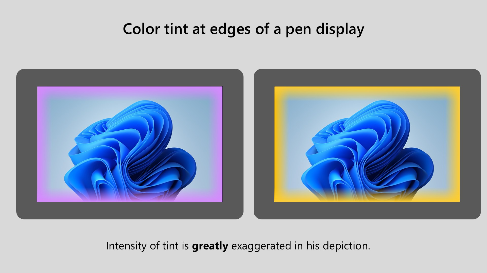
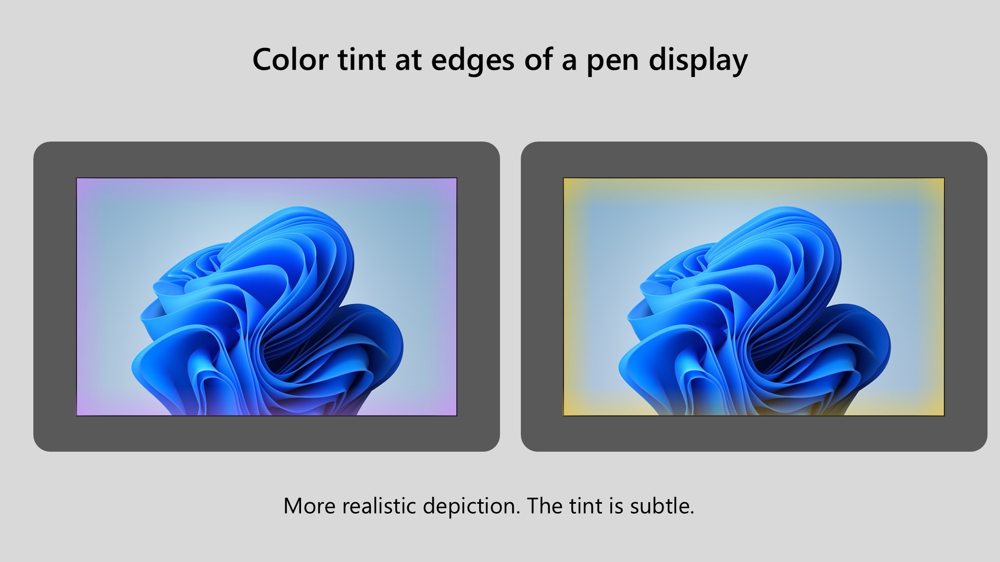

# Color tint on edges of display

## Overview

Some pen displays exhibit a color tint (purple/lilac or yellow/orange) at the edges of the display.

## Appearance

* The tint is NOT pixelated or rough. It has a very smooth look.
* It is often seen on all four edges. I can't think of any examples on only three or fewer edges.
* Can be very faint.
* You may notice it only when colors on the screen are bright.
* May appear when you first use your tablet, or develop much later. Out of 30+ pen displays, I have one display (Huion Kamvas 22 Plus) that developed a slight purple edge tint 3+ years after I bought it.

NOTE: The tint is greatly exaggerated in these diagrams.&#x20;

<figure><figcaption></figcaption></figure>

In practice, the effect is usually VERY subtle - as you can see below.

<figure><figcaption></figcaption></figure>

## Examples

<figure><figcaption>
Notice that the purple tint is visible even on a pure white background - it slightly darkens the white region
</figcaption></figure>

## When it appears

This effect can be visible the first time you use your pen display, or it can show up after you've been using the pen display for a long time.

## Compared to backlight bleed

Unlike backlight bleed, the tint is often visible even on a very bright or pure white background.

## Causes

Based on what I have read, the cause is due to an issue with laminated displays (see: [Lamination](lamination.md)).

My leading theory as to the specific cause is an issue with the polarizer layer in the display. When there is a polarizer failure it can appear in very different ways visually - sometimes very harsh effects and sometimes much more subtle (as in this case).

The polarizer might

* delaminate (separate from the rest of the display)
* be oriented incorrectly
* be damaged by heat
* be damaged by pressure

Laminated displays have a layer of optically clear adhesive (OCA) between the glass and the display. This might also contribute to or be the source of the problem.

## How often it occurs

Overall it is uncommon.

Of the 30+ pen displays I own, it is present in none of the laminated display devices I have.

## Manufacturer pages

* Huion: [https://support.huion.com/en/support/solutions/articles/44002336996-how-to-adjust-color-difference-on-the-edge-of-your-tablet-by-importing-the-new-color-gamut-file-windo](https://support.huion.com/en/support/solutions/articles/44002336996-how-to-adjust-color-difference-on-the-edge-of-your-tablet-by-importing-the-new-color-gamut-file-windo)

## Links

* [https://www.reddit.com/r/huion/comments/10i3ftd/purple\_edges\_on\_my\_kanvas\_24\_plus/](https://www.reddit.com/r/huion/comments/10i3ftd/purple_edges_on_my_kanvas_24_plus/)
* [https://www.reddit.com/r/huion/comments/vo3o5m/bought\_a\_kamvas\_pro\_16\_25k\_local\_retailer\_says\_it/](https://www.reddit.com/r/huion/comments/vo3o5m/bought_a_kamvas_pro_16_25k_local_retailer_says_it/)
* [https://www.reddit.com/r/4kTV/comments/zt6kf2/sony\_purple\_edges/](https://www.reddit.com/r/4kTV/comments/zt6kf2/sony_purple_edges/)
