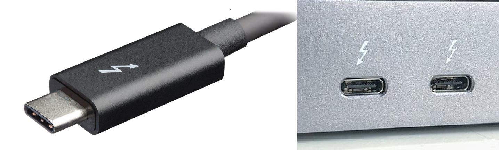
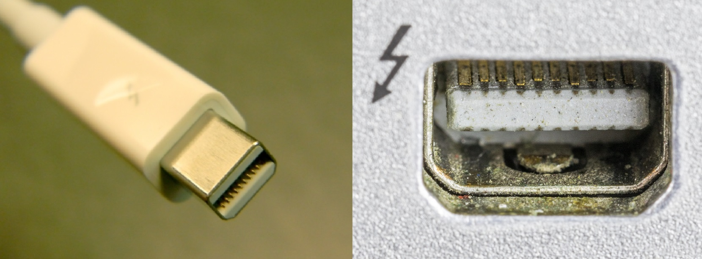

# Display connector types

## Overview

When working with pen displays tablets you'll encounter lots of different connector types. This is a visual map of those connectors.

## Terminology

* the "male" end is called the **plug**
* the "female" end is called the **receptacle**

## HDMI connectors

Wikipedia: [https://en.wikipedia.org/wiki/HDMI](https://en.wikipedia.org/wiki/HDMI)

.jpg>)

## DisplayPort connectors

Wikipedia: [https://en.wikipedia.org/wiki/DisplayPort](https://en.wikipedia.org/wiki/DisplayPort)

Normal-sized DisplayPort connectors

Mini-DisplayPort connectors

## USB-C connectors

Wikipedia: [https://en.wikipedia.org/wiki/USB-C](https://en.wikipedia.org/wiki/USB-C)

The important thing to remember about USB-C is that it is a popular connector type, but it often not clear what a given cable or port support. For example:

* Some ports and cables support power only
* Some ports and cables support power + data
* Some ports and cables support power + data + display signal
* Some ports may not deliver as much power as you need
* Some cables may not support as much power as you need

## Thunderbolt 3 and 4 connectors

Thunderbolt 3 and 4 use the same USB-C port shape.&#x20;

The important thing about thunderbolt cables and ports is that they are required to carry a display signal. So, if your USB

Wikipedia: [https://en.wikipedia.org/wiki/Thunderbolt\_(interface)](https://en.wikipedia.org/wiki/Thunderbolt\_\(interface\))

## Thunderbolt 2 connectors

Thunderbolt 2 connectors use the min-DisplayPort connector type. And again by definition they can carry a display signal.

## USB-A connectors

USB-A ports are not used to provide a display signal. They are being listed here as a reference so you know what they look like compared to the other USB ports.

## Other resources

* [Techquickie - Why DisplayPort Is Still Better Than HDMI](https://www.youtube.com/watch?v=qr-ACsQ1BXA) Aug 11, 2023
