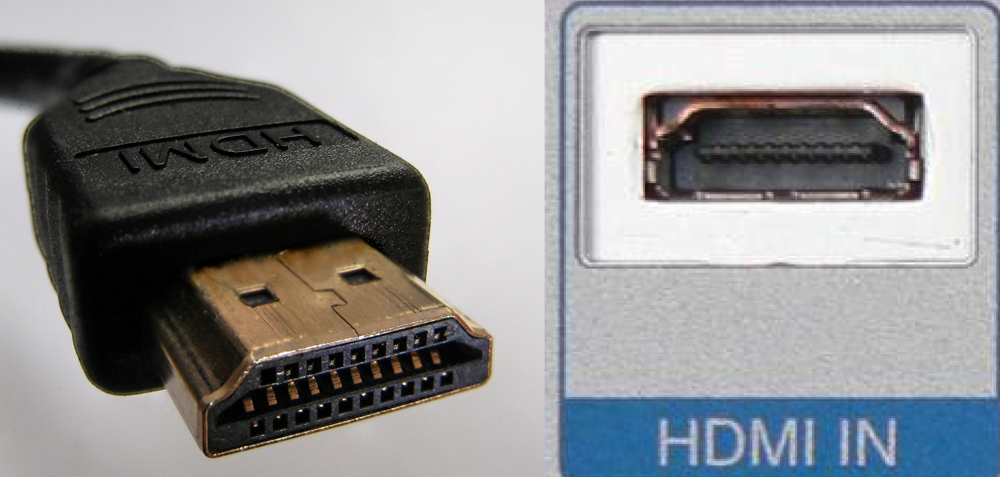
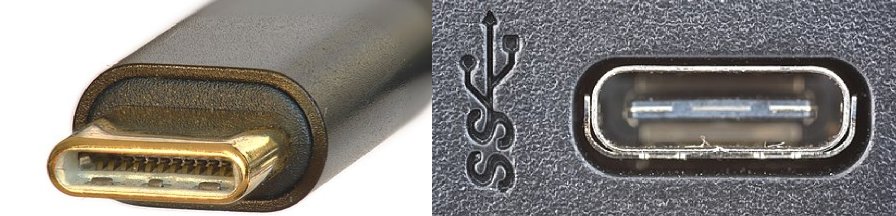
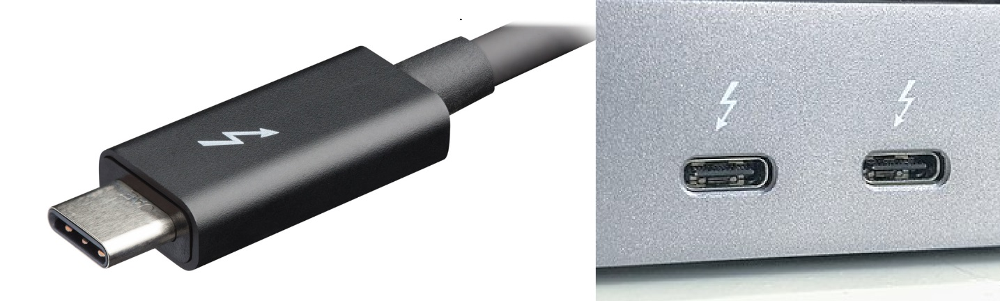
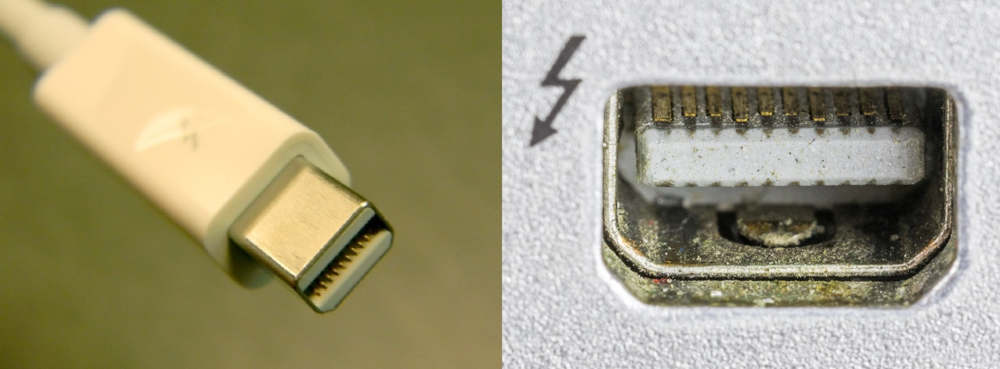

# Display connector types

## Overview

When working with pen display tablets, you'll encounter lots of different connector types. This is a visual map of those connectors.

## Terminology

* the "male" end is called the **plug**
* the "female" end is called the **receptacle**

## HDMI connectors

Wikipedia: [https://en.wikipedia.org/wiki/HDMI](https://en.wikipedia.org/wiki/HDMI)

The normal sized HDMI connector is shown below.

There are some smaller versions of HDMI connectors and ports. The Micro and Mini sizes are not common.

<figure><figcaption></figcaption></figure>

## DisplayPort connectors

Wikipedia: [https://en.wikipedia.org/wiki/DisplayPort](https://en.wikipedia.org/wiki/DisplayPort)

Normal-sized DisplayPort connectors

<figure><figcaption></figcaption></figure>

Mini-DisplayPort connectors

<figure><figcaption></figcaption></figure>

## USB-C connectors

Wikipedia: [https://en.wikipedia.org/wiki/USB-C](https://en.wikipedia.org/wiki/USB-C)

The important thing to remember about USB-C is that it is a popular connector type, but it is often not clear what a given cable or port supports. For example:

* Some ports and cables support power only
* Some ports and cables support power + data
* Some ports and cables support power + data + display signal
* Some ports may not deliver as much power as you need
* Some cables may not support as much power as you need

## Thunderbolt 3 and 4 connectors

Thunderbolt 3 and 4 use the same USB-C port shape.

The important thing about Thunderbolt cables and ports is that they are required to carry a display signal. So, if your USB-C cable or port supports Thunderbolt 3 or 4, it can carry a display signal.

Wikipedia: [https://en.wikipedia.org/wiki/Thunderbolt\_(interface)](https://en.wikipedia.org/wiki/Thunderbolt_\(interface\))

## Thunderbolt 2 connectors

Thunderbolt 2 connectors use the mini-DisplayPort connector type. Again, by definition, they can carry a display signal.

## DVI connectors

DVI is an older video signal connector type. They are rare these days but you will find them on somewhat older hardware. Be aware that there are multiple DVI port types that are physically different so that not all DVI cables can plug into all DVI ports.&#x20;

<figure><figcaption></figcaption></figure>

<figure><figcaption></figcaption></figure>

## VGA

These are EXTREMELY old connector types.

<figure><figcaption></figcaption></figure>

## USB-A connectors

USB-A ports are not used to provide a display signal. They are being listed here as a reference so you know what they look like compared to the other USB ports.

<figure><figcaption></figcaption></figure>

## Resources

* [Techquickie - Why DisplayPort Is Still Better Than HDMI](https://www.youtube.com/watch?v=qr-ACsQ1BXA) Aug 11, 2023
