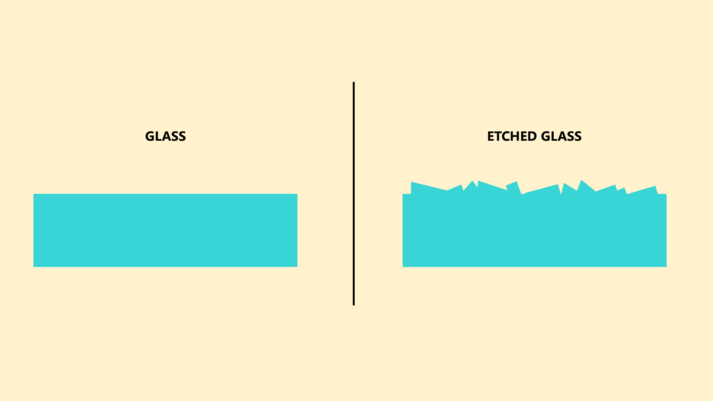

# Etched glass

## Overview

Etched glass is one of two popular treatments for the glass surface of a pen display. The other is called an [anti-glare film](anti-glare-film.md).

"Etched glass" describes a microscopic texture applied to a glass surface.

Etched glass provides two benefits:

* It reduces glare and reflections caused by light hitting the tablet. Etched glass does this by scattering that light.
* It provides more "grip" for the pen. Without the etching, a pen would feel "slippery" on the smooth glass surface.

<figure><figcaption></figcaption></figure>

## Sparkle

Like other anti-glare treatments, etched glass can produce an effect called **anti-glare sparkle**, which is a "rainbow noise" effect. Depending on the tablet, there will be a little or a lot of this sparkle. Learn more here: [Anti-glare sparkle](ag-sparkle.md).

## Permanence

Etched glass is a permanent treatment to the glass. It cannot be removed.
