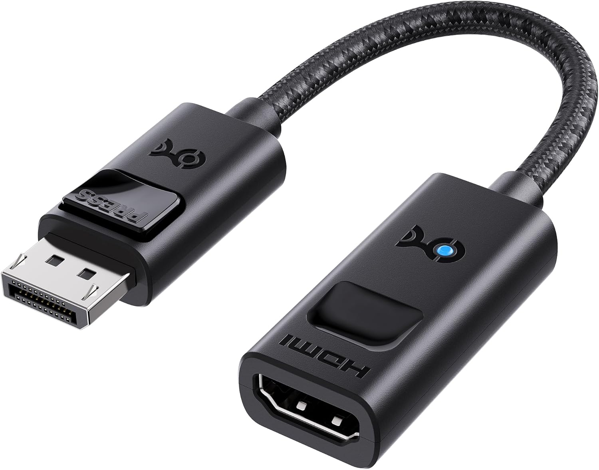

# DisplayPort to HDMI adapters

These will be MALE DisplayPort to FEMALE HDMI.

<figure><figcaption></figcaption></figure>

**Quality**: There is no loss in quality when using this kind of adapter.

**Tip**

* Make sure any adapter you buy meets your needs for your drawing tablet's resolution and refresh rate.

**What I use**

* DisplayPort - for a 4K display up to 240Hz - [https://www.amazon.com/Cable-Matters-102101-BLK-Computer-Adapter/dp/B08XFSLWQF/](https://www.amazon.com/Cable-Matters-102101-BLK-Computer-Adapter/dp/B08XFSLWQF/)
* Display Port - For a 1980x1080 display at 60Hz: [https://www.amazon.com/gp/product/B00K2E4T88/](https://www.amazon.com/gp/product/B00K2E4T88/)
* Mini DisplayPort - for 1980x1080 display at 60Hz: [https://www.amazon.com/gp/product/B00K0UDJFI](https://www.amazon.com/gp/product/B00K0UDJFI)
