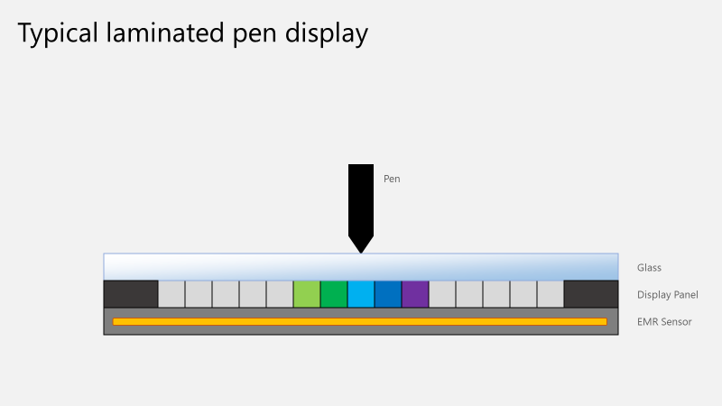
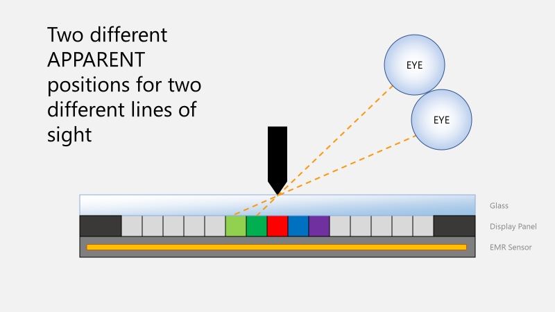
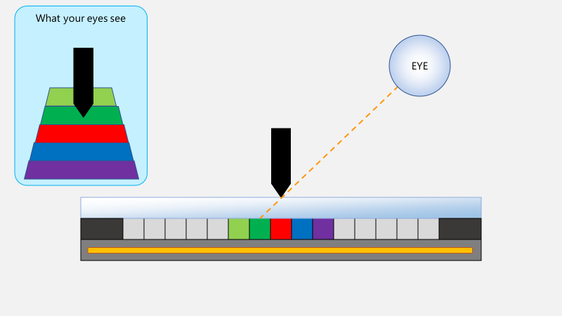
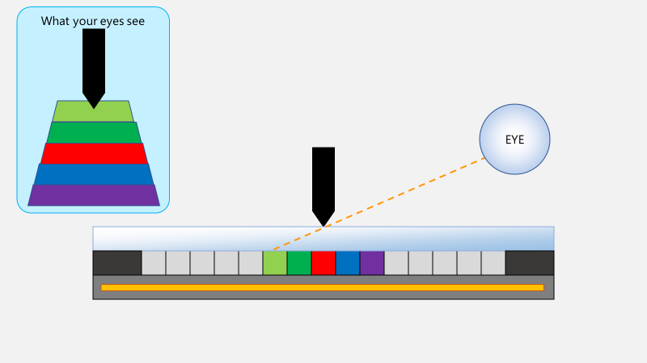
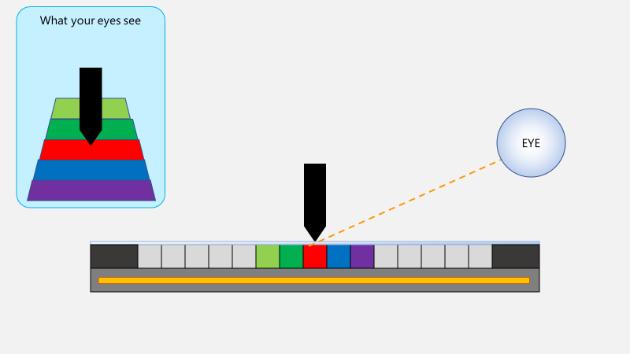
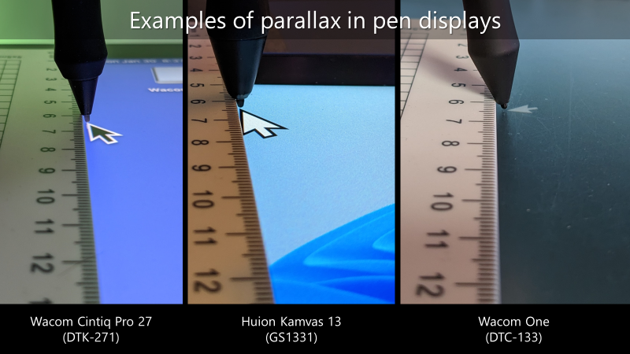
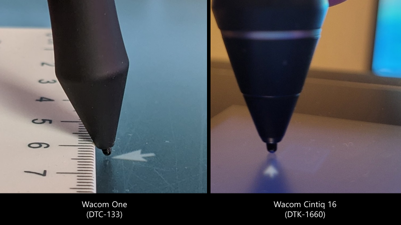

# Parallax

## Definition

Parallax is an **apparent** inaccuracy in pen tracking caused by physical separation between the display panel and the surface the pen tip touches. The apparent inaccuracy changes as the position of your eyes changes relative to the pen on the tablet.

## Video

Parallax is discussed in great detail in this video ([https://youtu.be/M4rEk\_RNBrM](https://youtu.be/M4rEk_RNBrM))

## Cause

The cause of parallax is a physical separation between the display panel and the tip of the pen. Whenever there is any distance between the two, some parallax will be introduced. The greater the separation, the greater the visual effect of the parallax.

In pen displays, this happens because the glass that covers the display panel has non-zero thickness.

<figure><figcaption></figcaption></figure>

Depending on where your eye is, what you see the pen tip pointing to will be different.

<figure><figcaption></figcaption></figure>

Compare this line of sight:

<figure><figcaption></figcaption></figure>

To this one:

<figure><figcaption></figcaption></figure>

Clearly parallax makes you see different things.

Additional parallax can be introduced by:

* anti-glare matte films applied on top of the glass
* protective films on top of the glass
* a touch sensor between the glass and the display panel

## Reducing parallax

The way to reduce parallax is to minimize the distance between the pen tip and the display panel.

Here is a thick sheet of glass with lots of parallax:

<figure><figcaption></figcaption></figure>

Compare it to a very thin sheet of glass with much less parallax:

<figure><figcaption></figcaption></figure>

## Lamination

Especially in older models of pen displays and pen computers, there is an air gap between the display panel and the glass. This air gap itself is another source of parallax. Replacing the air gap so that it is replaced with an optically clear adhesive can improve the parallax.

Learn more here: [Lamination](lamination.md)

It is always preferable to buy a drawing tablet that has a laminated display.

## Good examples of parallax

The Apple iPad Pro has the best (lowest) parallax I've ever seen. I would rank it as EXCELLENT.

## Parallax vs pen tracking accuracy

**Parallax** introduces an **apparent** visual inaccuracy.

Consider these two cases:

1. A pen display that tracks the pen position **perfectly**. If there is any distance between the display panel and where the pen tip touches the tablet, then there will still be some parallax — an apparent inaccuracy.
2. A pen display that does not track the pen position accurately but also has no distance between the display panel and the pen tip. Such a pen display would have no parallax effect, but there would still be real inaccuracy.

So we see that inaccuracy comes from two sources:

* apparent inaccuracy from the parallax
* actual inaccuracy from the tablet EMR sensor

Very often, people refer to any visual discrepancy as **"parallax"**, but that is incorrect. The term only applies when the position of your eyes, combined with the physical separation between the display panel and the glass, causes the discrepancy.

## Is parallax always bad?

Generally, users of drawing tablets do not want to see parallax.

However, some people find parallax slightly beneficial. They like being able to see where they are drawing on the display, and a slight offset can make that point easier to see.

## Examples of parallax

These three pen displays show very good parallax performance. Notice that the one on the left is a $3500 pen display, while the two on the right are entry-level $300 pen displays. All of these displays are laminated.

<figure><figcaption></figcaption></figure>

Compare the laminated pen display on the left to the unlaminated pen display on the right. Disregard the blurry image - that is an issue with the photograph itself. Notice how far away the tip of the pen is from the tip of the point.

<figure><figcaption></figcaption></figure>

## Resources

* [https://en.wikipedia.org/wiki/Parallax](https://en.wikipedia.org/wiki/Parallax)
* [Sweet Monia: What is parallax? And is it really bad in a pen display like Cintiq or Kamvas?](https://sweetmonia.com/Sweet-Drawing-Blog/what-is-parallax-and-is-it-really-bad-in-a-pen-display-like-cintiq-or-kamvas/)
