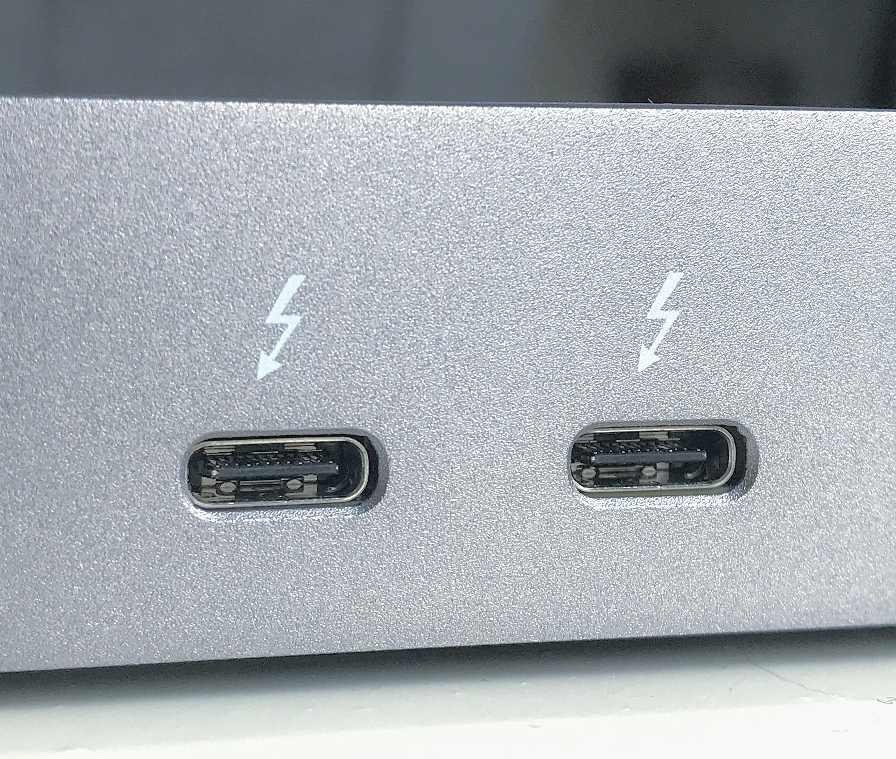

# USB-C DisplayPort alt mode

## Overview

If you want to send a display signal from your computer to a pen display via a USB-C cable, then the ports and cables need to support **DP alt mode** (DisplayPort Alternative Mode).

<mark style="color:red;">**NOT ALL USB-C PORTS OR CABLES SUPPORT DP ALT MODE.**</mark>

Support for DP alt mode is something you must verify for your ports and your cables. Sometimes this is not straightforward to do. You will find multiple techniques described below.

## Verifying if your USB-C port or cable supports DP alt mode

### Option 1: DisplayPort alt mode symbol

The DisplayPort symbol indicates the cable or port supports DP alt mode. Unfortunately many cables that DO support DP alt mode, do not have this logo.

<figure><figcaption></figcaption></figure>

### Option 2: Thunderbolt symbol

The Thunderbolt symbol indicates a cable or port supports DP-alt mode.

Here is an example of two USB-C ports with the Thnderbolt symbol

<figure><figcaption></figcaption></figure>

Here is an example of a cable with a Thunderbolt symbol.

<figure><figcaption></figcaption></figure>

Unfortunately, many USB-C thunderbolt ports and cables simply do not have the thunderbolt logo on them.&#x20;

### Option 3: Unlabeled ports and cables

If your cable or port, does not support DP alt mode, you have several remaining strategies:

* **Read the documentation**. Look for for the words "Thunderbolt" of "DP alt mode". Sometimes the documentation will say something more ambiguous like "supports display".
* **Contact product support** from your manufacturer. Just ask them!
* **Reach out to an online community** and ask if anyone has been able to use that port in their tablet to receive a display signal.&#x20;

## Things to keep in mind

* You have to verify DP support for the USB-C port AND the USB-C cable. Just having one support DP alt mode is not enough.
* DP alt mode has nothing to do with whether the port or cable can carry power or carry enough power. That is a separate issue.
