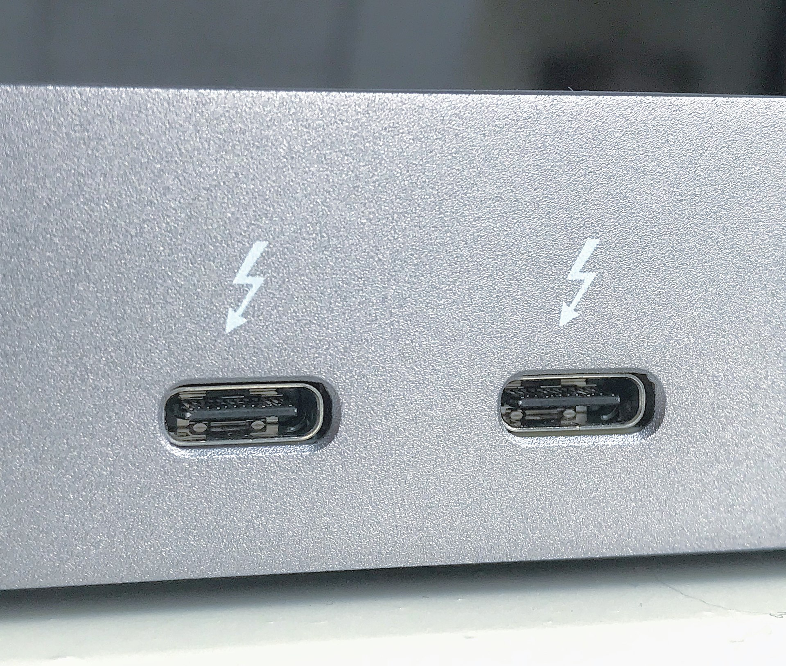
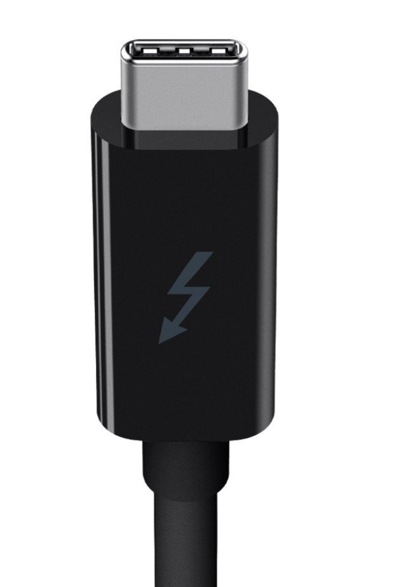

# USB-C DisplayPort alt mode

## Overview

If you want to send a display signal from your computer to a pen display via a USB-C cable, then the ports and cables need to support **DP alt mode** (DisplayPort Alternative Mode).

<mark style="color:red;">**NOT ALL USB-C PORTS OR CABLES SUPPORT DP ALT MODE.**</mark>

Support for DP alt mode is something you must verify for your ports and your cables. Sometimes this is not straightforward to do. You will find multiple techniques described below.

## Verifying if your USB-C port or cable supports DP alt mode

### A quick clue: is the USB-C port on a GPU?

If the USB-C port is on a graphics card (GPU), it will carry a video signal — sending video is the whole purpose of a GPU's ports. A USB-C port anywhere else (on the motherboard I/O panel, on a laptop, etc.) may or may not support video, so keep reading. Even for a GPU port, it doesn't hurt to confirm with the documentation.

### Option 1: DisplayPort alt mode symbol

The DisplayPort symbol indicates that the cable or port supports DP alt mode. Unfortunately, many cables that do support DP alt mode do not have this logo.

<figure><figcaption></figcaption></figure>

### Option 2: Thunderbolt symbol

The Thunderbolt symbol indicates a cable or port supports DP-alt mode.

Here is an example of two USB-C ports with the Thunderbolt symbol.

<figure><figcaption></figcaption></figure>

Here is an example of a cable with a Thunderbolt symbol.

<figure><figcaption></figcaption></figure>

Unfortunately, many USB-C Thunderbolt ports and cables simply do not have the Thunderbolt logo on them.


**Don't confuse the Thunderbolt symbol with a plain lightning-bolt symbol.** Some USB-C ports have a lightning-bolt icon that only means the port can deliver **power** (charging). That is NOT the Thunderbolt symbol, and it tells you nothing about DP alt mode. The Thunderbolt symbol has its own distinct shape.


### Option 3: USB4 ports

If a port is a **USB4** port, it supports DP alt mode — that is part of the USB4 standard. The catch is that USB4 ports usually aren't labeled, so you may need to check your device's documentation to confirm that a port is USB4 in the first place.

### Option 4: Unlabeled ports and cables

If your cable or port does not clearly indicate DP alt mode, you still have several strategies:

* **Read the documentation**. Look for the words "Thunderbolt" or "DP alt mode." Sometimes the documentation will say something more ambiguous, like "supports display."
* **Contact product support** from your manufacturer. Just ask them!
* **Reach out to an online community** and ask if anyone has been able to use that port in their tablet to receive a display signal.

## Things to keep in mind

* You have to verify DP support for the USB-C port AND the USB-C cable. Just having one support DP alt mode is not enough.
* DP alt mode has nothing to do with whether the port or cable can carry power or carry enough power. That is a separate issue.
