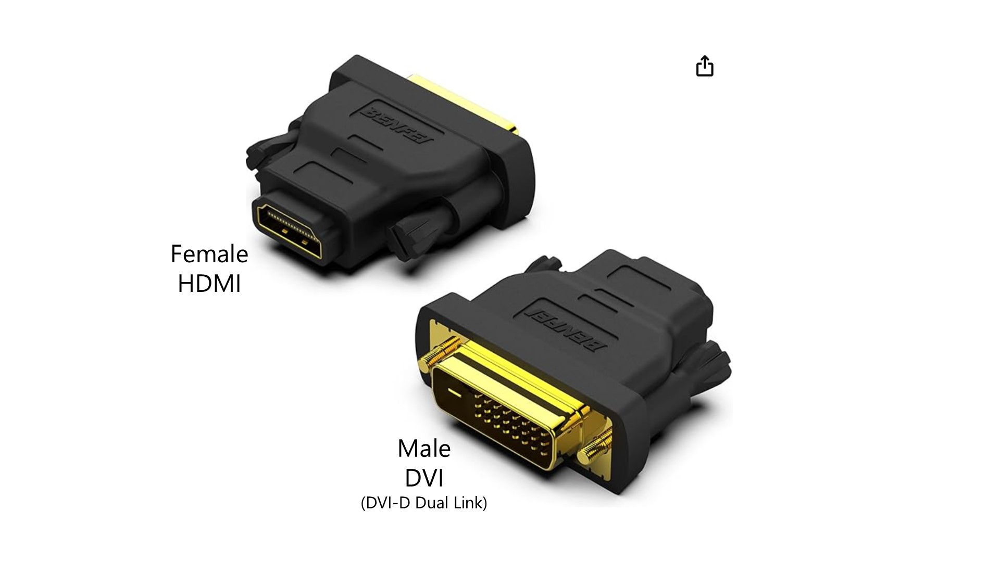

# DVI to HDMI adapters

## Overview

DVI is a bit of an older display protocol type. There are DVI-to-HDMI adapters on the market but I don't  have a direct experience in using them.

If your computer has a DVI port:

* You need to know the "shape" of the DVI port (see below)
* And get a male DVI to female HDMI adapter that matches that port type

## Example

Here's an example of such an adapter.

<figure><figcaption></figcaption></figure>

## DVI port types

<figure><figcaption></figcaption></figure>

## Videos:

* [ZachEberly -DVI-D to HDMI Adapter TESTING! | Questions and Answers!!](https://www.youtube.com/watch?v=oaFlLtkOh\_c) \[2020]&#x20;

## Reddit threads

* [/r/wacom - will this hdmi to dvi adapter work with a cintiq ](https://www.reddit.com/r/wacom/comments/13kqia7/will\_this\_hdmi\_to\_dvi\_adapter\_work\_with\_a\_cintiq/)&#x20;

## Other resources

* https://en.wikipedia.org/wiki/Digital\_Visual\_Interface&#x20;
