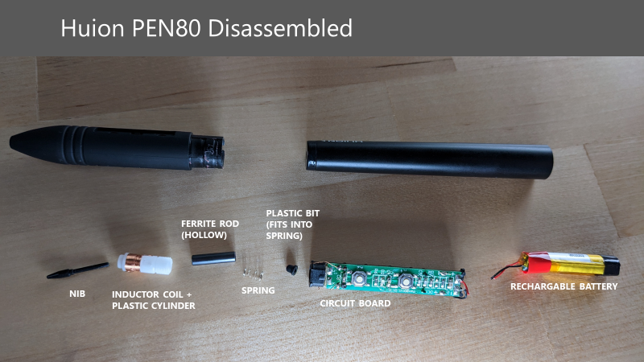

# Pen teardowns

## XP-Pen X3 pen

See this Reddit post:

* https://www.reddit.com/r/XPpen/comments/1buiyvy/dismantlingteardown\_of\_x3\_stylus\_for\_artist\_16/

## Huion PEN80

The Huion PEN80 is a VERY OLD Huion pen. It uses an active EMR design, meaning it uses a rechargeable battery for power instead of getting power from the tablet. Again, it is very old, and newer Huion pens like the PW517 and other models are passive EMR pens.

I mentioned the Huion PEN80 in my 2022 EMR video as an example of one older method in which pressure information is transmitted from the pen to the tablet.

<figure><figcaption></figcaption></figure>

* The nib fits into the hollow ferrite rod.
* There is enough pressure in the ferrite rod that the nib does not fall out.
* The nib does not go all the way through the ferrite rod. There's about 2 mm left inside the ferrite rod.
* The spring touches the ferrite rod.
* The plastic piece fits into the spring.
* The wires from the inductor coil to the circuit board have been cut to make it easier to present.
* The wires from the circuit board to the rechargeable battery have been cut to make it easier to present.
* Panda Tech: Huion Pen80 Disassemble & Reassemble ([https://youtu.be/F3Y3uxPhVlY](https://youtu.be/F3Y3uxPhVlY))
