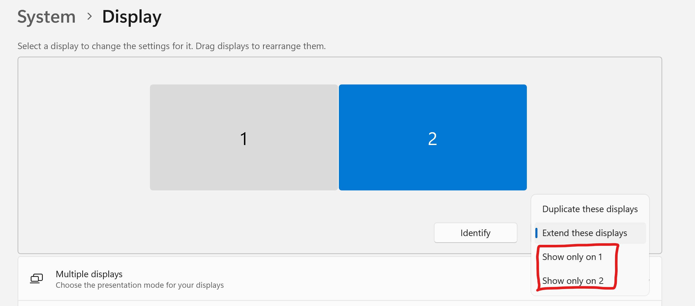
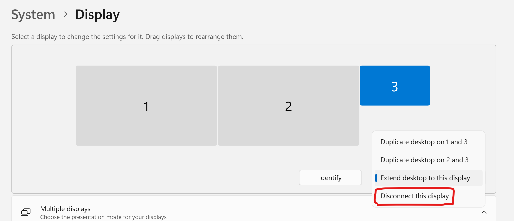
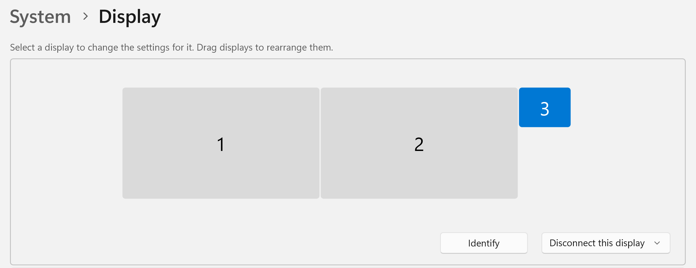
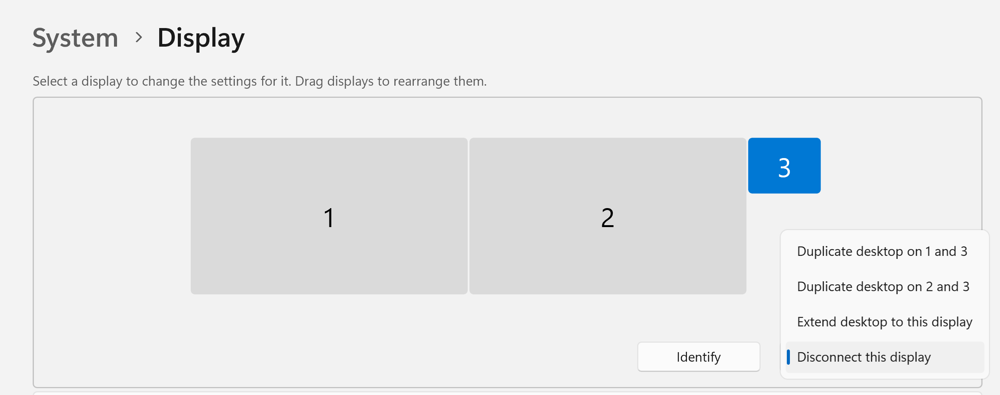

# Stop using a display on Windows

## Overview

With Windows, if you have N displays plugged in, Windows will always try to use all N displays.

However, in **Display Settings** you can tell Windows to stop sending a video signal to specific displays.

## If two displays are plugged in

If only two displays are connected, Windows gives you the option to "Show only on 1" or "Show only on 2".

<figure><figcaption></figcaption></figure>

## If 3 or more displays are plugged in

In Windows 11, the options look a little different if you have 3 displays connected. Below, 3 are connected, and the way to get Windows to stop using one of them is to click **Disconnect this display**.

<figure><figcaption></figcaption></figure>

## How Windows shows a disconnected display

Once you have disconnected a display, Windows still shows you the display in Display Settings. But its current state will show as "Disconnect this display".

<figure><figcaption></figcaption></figure>

## Re-connecting a display

Once you've disconnected a display, you can always reconnect it by clicking that button and selecting an extend or duplicate option.

<figure><figcaption></figcaption></figure>
