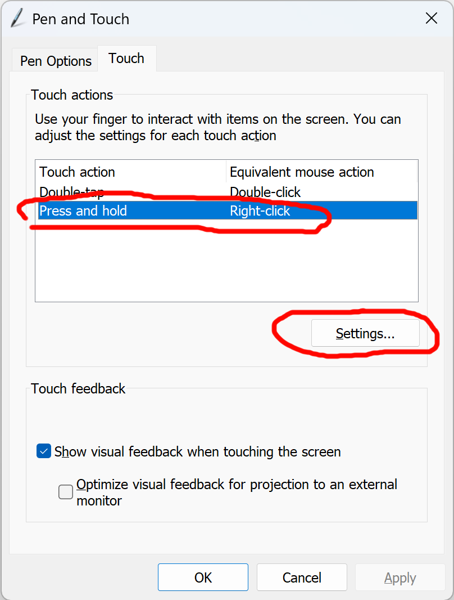
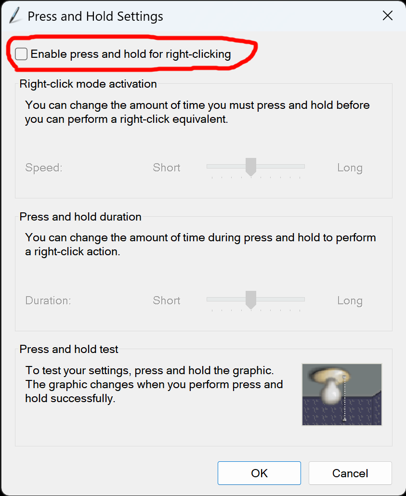

# Disable the press-and-hold ring in Windows

## Windows 11

### Get to the Pen and Touch settings

* Open the [Windows Pen and Touch Control Panel](windows-pen-and-touch-control-panel.md)
* Navigate to the **Touch** tab
* Select **Press and Hold**
* Click **Settings**

* The **Press and Hold Settings** dialog will launch
* Disable **Enable press and hold for right-clicking**

* Click **OK** to close the **Press and Hold Settings** dialog
* Click **OK** to close the **Pen and Touch** dialog
