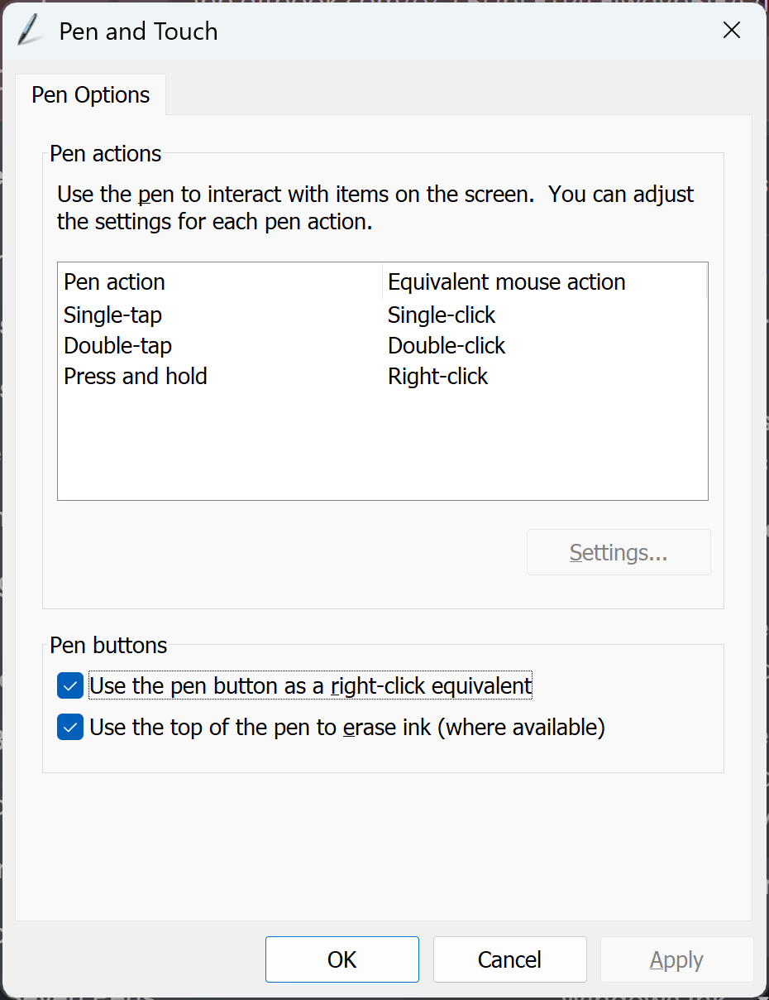

# Windows Pen and Touch Control Panel

## Launching&#x20;

### Method 2: Using the command line (fastest)

Run the following command in a CMD shell or via the Windows+R Run menu

```
"C:\WINDOWS\system32\rundll32.exe" shell32.dll,Control_RunDLL TabletPC.cpl @0,pen
```

### Method 2: Using the Control Panel

* Open the Control Panel ap
* Search for "Pen and Touch"

## UI

<div align="left"><figure><figcaption></figcaption></figure></div>
