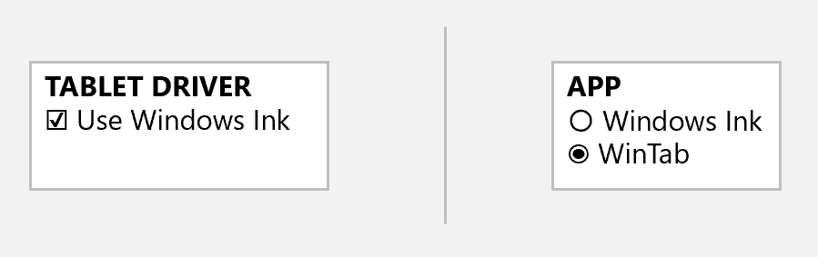
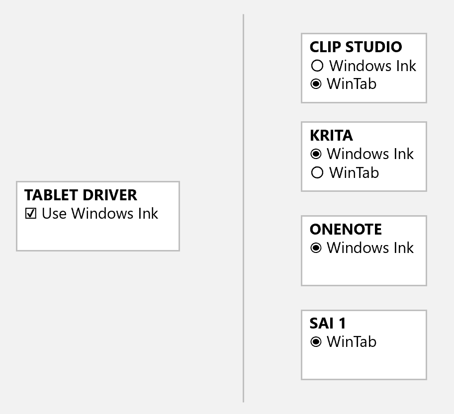
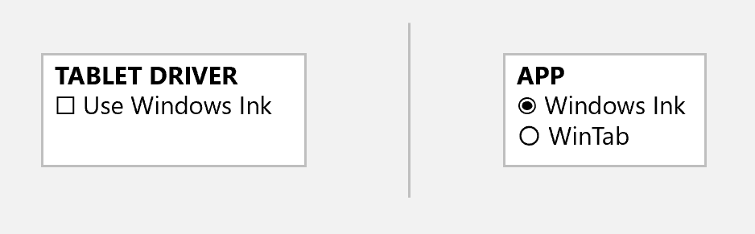
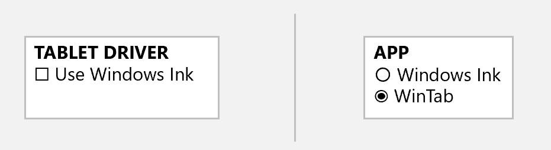
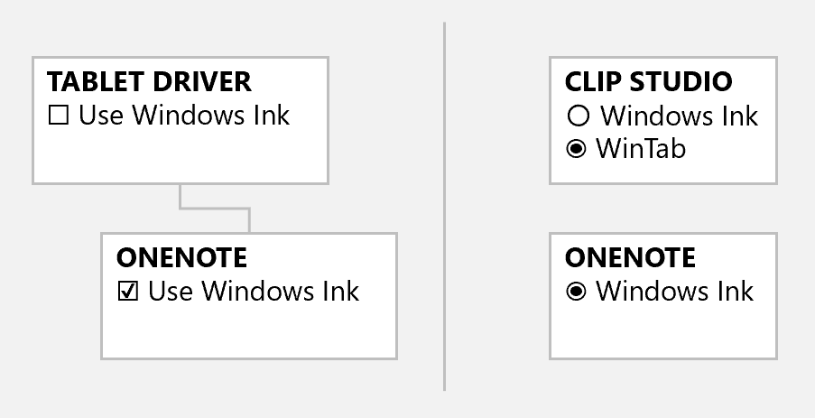

# Windows Ink

## **Overview**

**Windows Ink** in the context of drawing tablets is an API in Microsoft Windows enables using a pen to work with your computer.

In windows you could think of this as a "lanaguage". As long as your tablet driver and application are using the same "language" then your application will work with your drawing tablet and be able to use features like pressure and tilt.&#x20;

Windows Ink is one of two APIs used for Windows to talk to a tablet. The other, older one, is called WinTab.

### Background

More here: [The history of Windows Ink](winink-history.md).&#x20;

## Configuring Windows Ink

Remember: our goal is to make sure a tablet an application are talking the same language to each other.

### Basic experience

In general you can configure Windows Ink in two places: In the tablet driver and in an application.

Conceptually the user experience looks like this:

<figure><figcaption></figcaption></figure>

For a tablet driver, the Windows Ink configuration is always a single checkbox. For details on the eact user interface in the drivers, look here [Configure Windows Ink in the tablet driver](winink-config-driver.md).&#x20;

For apps, typically the Windows Ink configuration is presented as a set of choices. The simplest set of choices will literally say "Windows Ink" and "WinTab". And sometimes the user interface is just very different from what is shown above. To find exact details for an app, go here: [Configure Windows Ink for apps](winink-config-apps.md)

## How these configuration settings behave

### Tablet drivers&#x20;

* Tablet drivers ALWAYS work with WinTab. The checkbox has NO EFFECT on whether a tablet driver supports WinTab.
* The tablet driver Windows Ink checkbox only controls whether they ALSO work with Windows Ink. So if he checkbox is enabled, it means the driver is talking BOTH Windows Ink and WinTab.
* You DO NOT need to restart the driver if you change this setting.&#x20;

### Applications

* The choice is mutually exclusive. The app will only using ONE of the two APIs at any given time. It will EITHER use Windows Ink OR ELSE it will use WinTab.
* If you change this setting, you SHOULD restart the app. For some apps, it doesn't matter. But other apps become very confused if you switch this setting and try to continue drawing.&#x20;

## My recommendation for configuring

This approach is summarized as:&#x20;

* The driver will talk in whatever language an app wants.
* Apps will talk to the driver in whatever language they prefer.
* Sometimes an app has a problem with Windows Ink and you need to force the app to talk in WinTab.

### Base configuration

* In Tablet Driver - Enable Windows Ink - this means Windows Ink will be available for all apps
* In Each App - Configure the app to use Windows Ink. If you change the setting, restart the app.

<figure><figcaption></figcaption></figure>

This configuration will work with most apps.

### When apps have problems with Windows Ink

This covers:

* Apps that ONLY use WinTab
* Apps that are currently having problems with Windows Ink. This occasionally happens, and app will be working fine with Winows Ink and suddenly one day there are problems. And you may need to switch it to WinTab.

If you app gives you the choice between Windows Ink and WinTab, switch to WinTab and restart the app.

<figure><figcaption></figcaption></figure>

If the app only supports Windows Ink in the first place, you don't need to configure the app at all.

You don't need to change the tablet driver setting because no matter what the checkbox is set to, the driver will ALWAYS allow apps to talk to it with WinTab.

## Dealing with apps that use different languages

In windows, pen-aware apps have different behaviors controlling which tablet languages they speak.

* Some can be configured to speak either language.
* Some ONLY talk WinTab
* Some ONLY talk WinInk

How can we deal with this situation? It may seem complex, but the answer is simple: enable the Windows Ink checkbox in the driver - this allows the driver to talk to an app in whatever language the app wants.  The diagram below shows that in all cases the driver will any application.

<figure><figcaption></figcaption></figure>

## This configuration  will not work correctly

IN this configuration the tablet driver is being told to ONLY talk in WinTab and the application to only use Windows Ink. These settings DO NOT agree.

<figure><figcaption></figcaption></figure>

## App-specific overrides in the tablet driver

As shown above the driver setting is GLOBAL and affects ALL applications that talk with the driver.

However, for advanced cases you can configure your tablet driver to configure the Windows Ink setting for specific apps. However, you should not need to ever need to do this if you follow the recommendations I have given above.

## For some people WinTab is the better default choice

For lots of reasons, some people simply prefer using WinTab. So they will configure their setup like this.

<figure><figcaption></figcaption></figure>

Of course this means the tablet driver is never talking Windows Ink - only WinTab. While this works for an app like CSP which can speak either language, it may interfere with an app like Microsoft OneNote which only talks in Windows Ink. To solve this situation, you need to add an driver override for OneNote as illustrat4d below.

<figure><figcaption></figcaption></figure>

## Tips for troubleshooting

If you are having problems with your tablet on Windows, one of the first things you should verify is how Windows Ink is configured:

* In your application
* In your tablet driver
  * And check if the tablet driver has an app-specific configuration for Windows Ink
