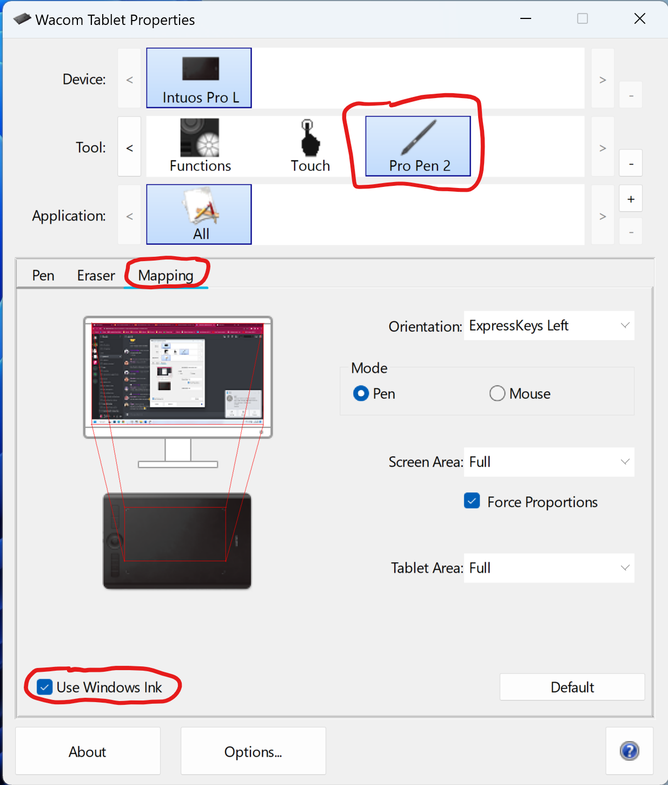
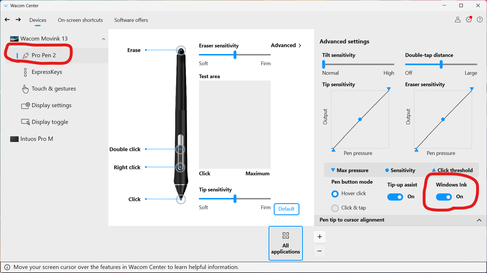
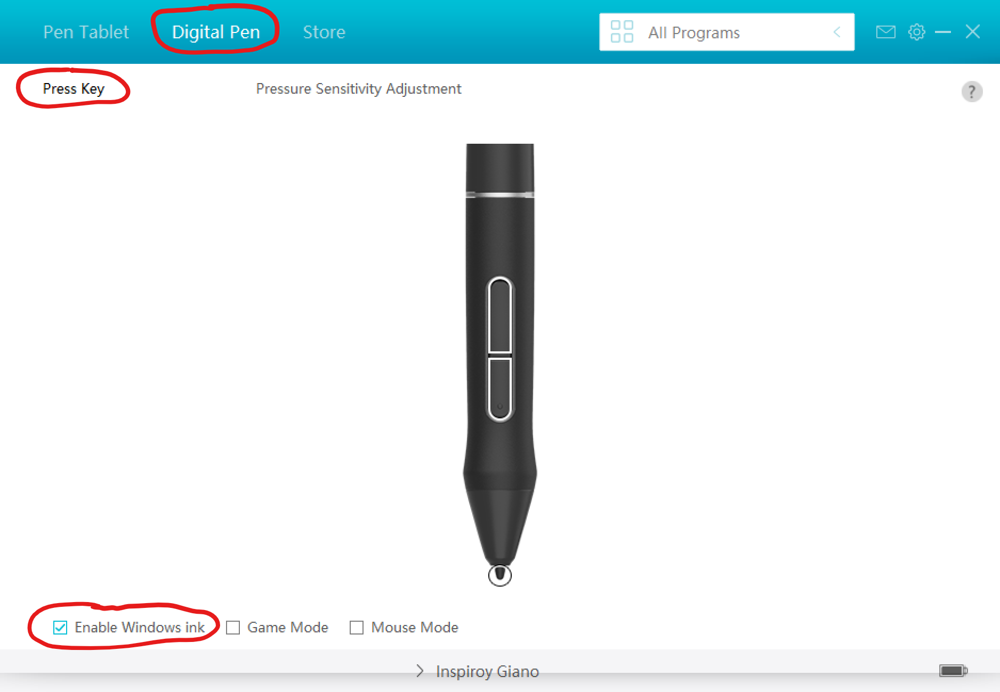
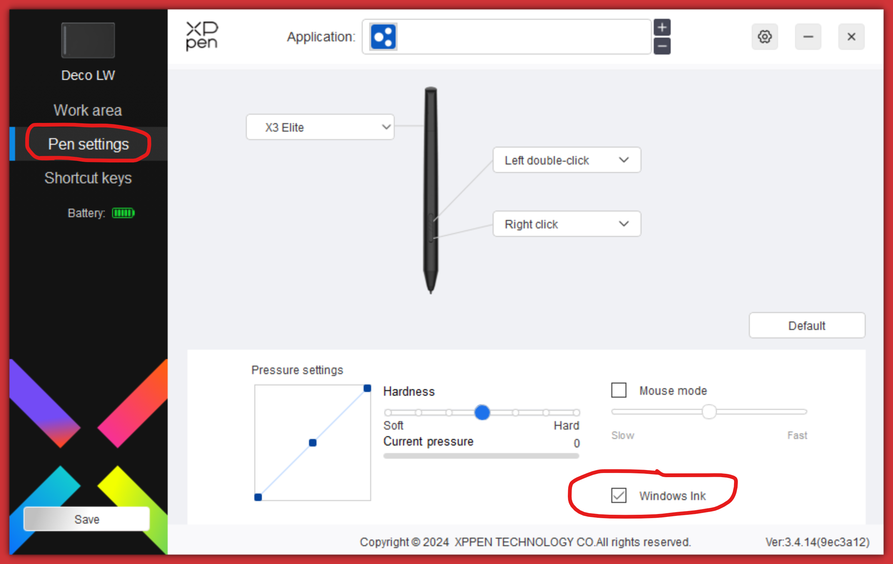
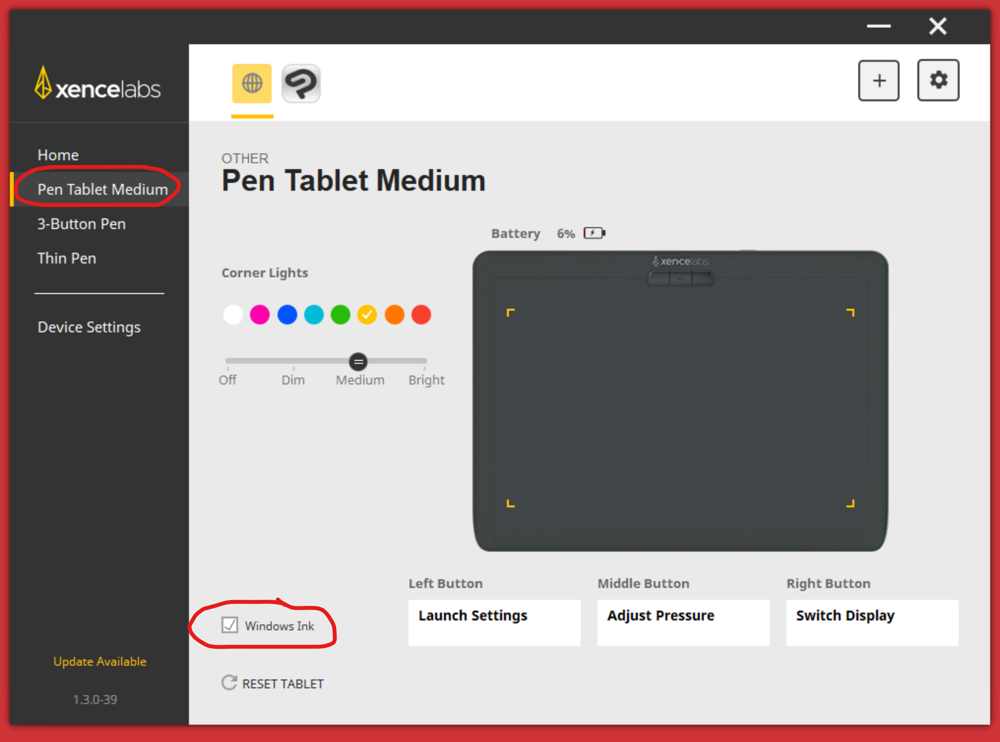
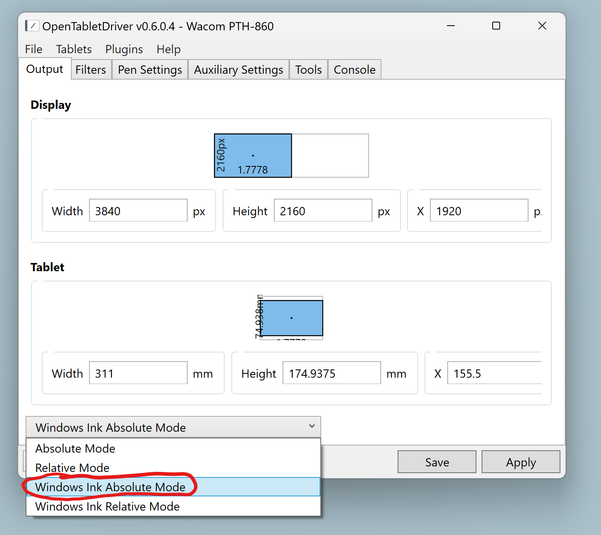

# Configure Windows Ink in the tablet driver

## Global and application-specific configuration

You can configure a driver's use of Windows Ink:

* For all applications
* For specific applications

This allows you to have a baseline configuration and then modify the behavior for specific applications as needed.

In general for the tablet driver I recommend:

* Enabling Windows Ink for all applications
* Disabling Windows Ink for specific applications that need it.

Every driver has a different way of configuring it in their UI:

* **Wacom:** Wacom Tablet Properties > Application
* **Huion**: The drop-down with the gear icon at the top.
* **OpenTabletDriver**: N/A - OTD does not support per-application Windows Ink configuration

## Wacom Driver > Wacom Tablet Properties

* Open the **Wacom Tablet Properties** app
* Under **Tool** select your pen
* If you have a pen tablet, go to the **Mapping** tab.
* Or if you have a pen display, go to the **Calibrate** tab.
* Set **Use Windows Ink** to turn on or off **Windows Ink** in the driver

## Wacom Driver > Wacom Center

<figure><figcaption></figcaption></figure>

## Huion Driver > Huion Tablet app

* Open the **HuionTablet** app
* Navigate to **Digital Pen**
* Under **Press Key**, use **Enable Windows Ink** to turn Windows Ink on or off in the driver

<figure><figcaption></figcaption></figure>

## XP-Pen driver > PenTablet App

* Open the **PenTablet** app
* Navigate to **Digital settings**
* Use **Windows Ink** to turn Windows Ink on or off in the driver

<figure><figcaption></figcaption></figure>

## Xencelabs Driver

<figure><figcaption></figcaption></figure>

## OpenTabletDriver

NOTE: To see the Windows Ink option, you have to install the OTD Windows Ink plug-in first.

