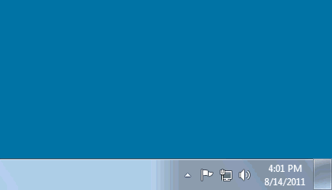

# Windows 7 Tablet PC features

If you click on the **Flicks** icon you’ll see the **Flicks** settings UI

What **Flicks** does: When you gesture with the pen, Windows will think you are giving it a command. For example, drawing a short down stroke will cause the following flick **Drag Down** notification.

### Press-and-Hold Ring

When you press down with the pen, you’ll see a “glowing ring” and when you lift the pen a property menu will appear.

What is happening is that Windows is treating you pressing and holding as if you want to do a normal “right click” with the mouse.

### Dynamic Feedback Rings

Dynamic feedback (aka Pen Feedback) is all the little rings that appear when you press down with the pen.

