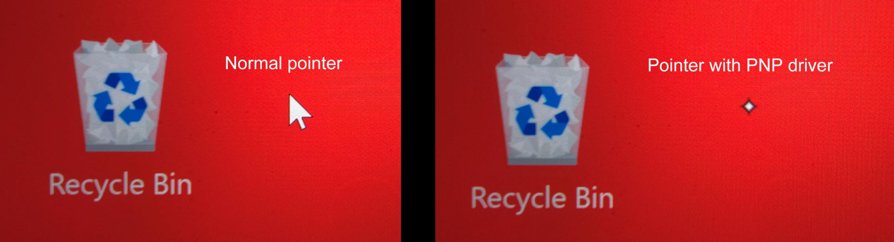

# Windows PNP support for drawing tablets

## Introduction

In Microsoft Windows, there are built-in drivers that "just work" for many devices. You can see this with mice. You just plug them in and they start working. So you can see why Windows calls these drivers "Plug-and-Play" or PNP.

Windows also has PNP tablet drivers! These drivers don't have many features compared to manufacturer tablet drivers but they can be useful.

* If you are just intending to use the tablet as a mouse replacement for pointing and selecting
* They are useful for troubleshooting problems with the manufacturer tablet drivers
* You can use them as a "last resort" if your manufacturer drivers are not working.

The key things you should know

* Not all tablets work with Windows PNP tablet drivers
* The drivers are extremely limited in what they can do.

## Feature support

* **pressure sensitivity** - PNP drivers do support this.
* **tilt sensitivity** - PNP drivers support this

## Limitations of PNP drivers

There are a large set of limitations that come with windows PNP mode. And many of the things you will need to configure with a drawing tablet simply are not available through PNP mode.

* You cannot control how to map the active area of your tablet to a display in any way
  * This means that mismatched aspect ratios for pen tablets which will result in distortion when drawing. More here explaining what this means: [Matching aspect ratios](../customizing-your-experience/matching-aspect-ratios.md)
* You cannot control what the buttons on the pen does
* You cannot control what the buttons on the tablet do&#x20;

## Is your tablet using PNP drivers with your tablet?

The easiest way to see if this how Windows is interacting with your tablet is to look at the system pointer.

Normally your pointer will look like this when you are using the mouse or when you have a tablet driver installed.&#x20;

<figure><figcaption></figcaption></figure>

(NOTE: It's hard to do a screen capture of this pointer, so I had to rely on a phone camera)

## When should you use PNP drivers?

If your manufacturer tablet driver is having problems, the PNP drivers may be a "last resort".

## Using PNP mode for testing and diagnosing problems

If you are having problems with your tablet, trying PNP mode can be a good diagnostic test to help identify if the problem is related to the manufacturer tablet driver or not. More here: [**Testing with Windows PNP drawing tablet drivers**](../../troubleshooting/testing-with-windows-pnp-drawing-tablet-drivers.md)&#x20;

## Interactions between tablet drivers and PNP mode

When you install a tablet driver, basically the tablet driver takes over handling the tablet and windows no longer uses its PNP mode.

And so the PNP mode will not affect you anymore.

Every now and then I have windows use PNP mode even though a driver is installed. Typically this seems to happen when:

* Windows is starting up and the tablet driver hasn't been started yet. For a little bit of time maybe a few seconds maybe 30 seconds you might see the PNP mode cursor. But then the tablet driver will start and it will go back to normal. I might see this happen once or twice a year on my windows machines
* Sometimes when the tablet driver is having problems working with windows then you might see the PNP mode being used. &#x20;

## Notes

Windows supports PNP for lots of devices. For example mice or monitors. PNP is not limited to just tablets.&#x20;

## Testing Windows PNP drivers with pen displays (screen tablets)

I plugged in a couple and their basic functionality worked subject to the limitations described earlier.

* Intuos Pro Small (PTH-460) - <mark style="color:red;">**does not work**</mark> (I get the sense this was a deliberate Wacom choice)
* Movink 13 (DTH-135) - does work
* Wacom One M (CTC-6110WL) - does work

## Testing Windows PNP drivers with pen tablets (screenless tablets)

Test with:

* Surface Pro 8
* Windows 11
* Krita

Results

* Huion HS611
  * Position : works
  * Pressure YES
  * Tilt: YES
  * Lower button: detected
  * Upper button: not detected (?)
* Wacom One Medium (CTC-6100WL) with CP-923 pen
  * Position: works
  * Pressure: YES
  * Tilt: YES
  * Lower button: detected&#x20;
  * Upper button: detected
* Wacom Intuos Pro Small (PTH-460) with Pro Pen 2
  * Nothing works
* Wacom Intuos Pro Medium (PTH-660) with Pro Pen 2
  * Nothing works
* Wacom Intuos Pro Medium (PTH-860) with Pro Pen 2
  * Nothing works
* XP-Pen Deco Pro XLW (MT1592B) with X3 Pro pen
  * Position : works
  * Pressure YES
  * Tilt: YES
  * Lower button: detected
  * Upper button: not detected (?)
* Huion Giano G930L with PW517 pen
  * Position : works
  * Pressure YES
  * Tilt: YES
  * Lower button: detected
  * Upper button: not detected (?)

