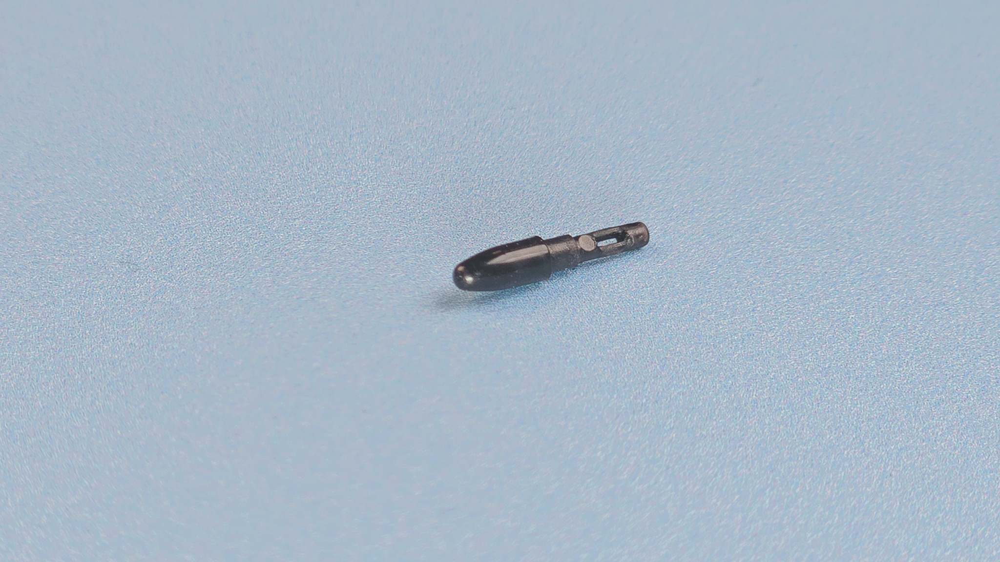

# XP-Pen P05 pen notes

## Overview

The pen is from an older generation of pen technology - with a higher IAF than you would find in modern EMR pens. If a tablet comes with this pen, you might be OK with it. But in general, I would recommend a different tablet with a different pen.

## Pen tech

EMR

## Buttons

2

## Eraser

NO

## Included with these tablets (partial list)

* XP-Pen Deco 01 V2
* XP-Pen Deco 01 V3

## IAF

Testing 5 pens, I found the IAF to be HIGH - varying between 6gf to 8gf.

Not as good as newer pens like the XP-Pen X3 Pro series.

## Max Pressure

I found the Max Pressure to be: OK&#x20;

* TYPICAL: 280gf
* RANGE: 200gf to 300gf

## Pressure response

<figure><figcaption></figcaption></figure>

## Photos

<figure><figcaption></figcaption></figure>

<figure><figcaption></figcaption></figure>

<figure><figcaption></figcaption></figure>
