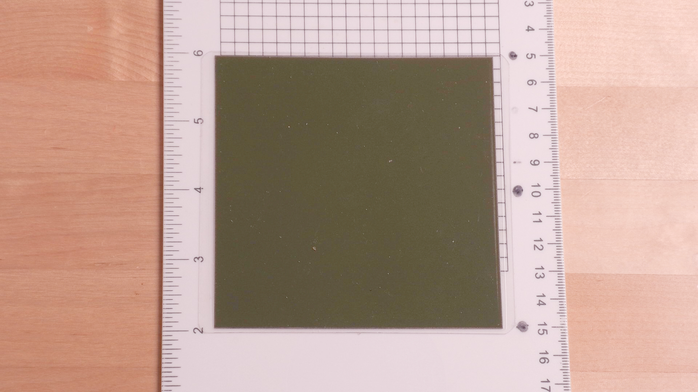
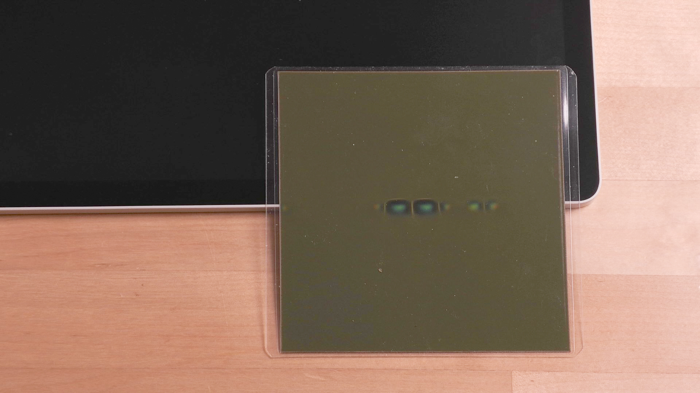
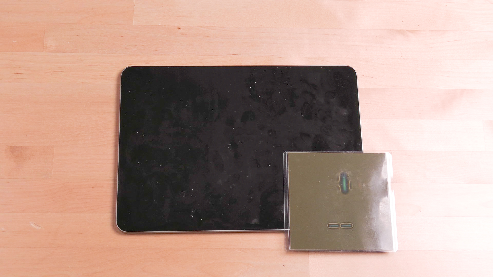
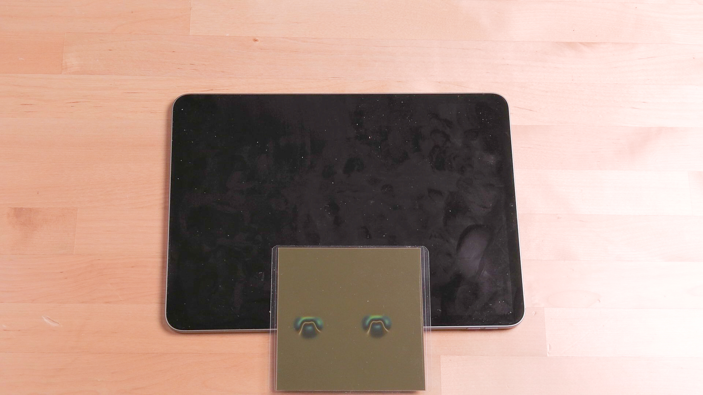

# Magnet detection

For some devices - especially standalone drawing tablet - it's useful to check where magnets are in the device.

For this purpose I use a magnetic field viewing film. The specific one I use is a 4"x4" square film that  when pressed on the surface of a device will reveal magnetic fields. It cost about $18 USD on Amazon.

<figure><figcaption></figcaption></figure>

\
\
Link: [https://www.amazon.com/dp/B0952FJWNZ](https://www.amazon.com/dp/B0952FJWNZ)&#x20;

Examples

Example 1 - magnets detected in the lower right corner of a Wacom MovinkPad Pro 14. This is one of four sets of magnets along the bottom edge.

<figure><figcaption></figcaption></figure>

Example 2 - Magnets in an iPad - there are magnets all over the edges of an iPad. Below are just two examples.

<figure><figcaption></figcaption></figure>

<figure><figcaption></figcaption></figure>

