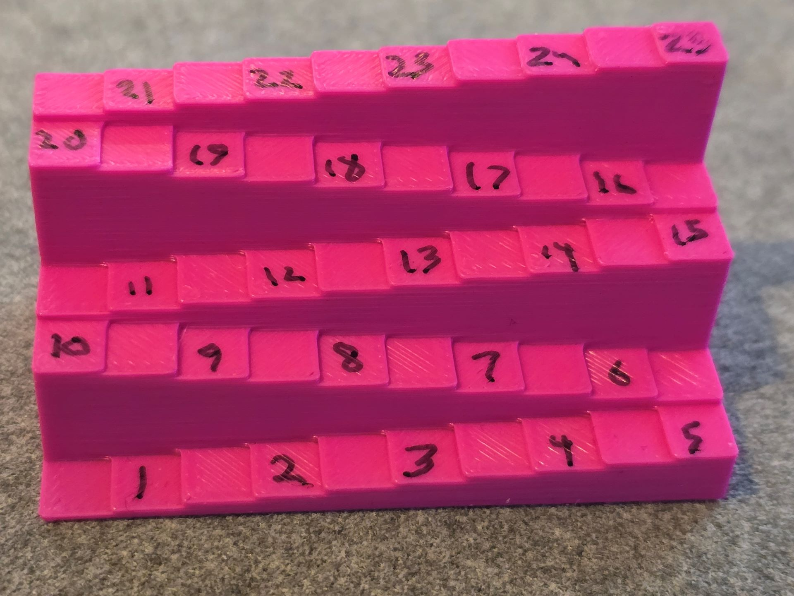

# Measuring hover

## Overview

To more accurately assess hover height, I use a small "staircase" that cost up by 0.5mm increments to test how hover works with tablets.

## The hover testing tool&#x20;

<figure><figcaption></figcaption></figure>

## Testing process

* Overall I move "down to up"&#x20;
* I begin with the pen placed on the first step which represents 0.5mm from the tablet surface.
* I then move up each step (0.5mm increment each time)
* On each step I notice
  * Whether the tablet detects the pen
  * If the tablet detects the pen, then whether there is any hover jitter. And how much hover jitter there is.
* I move up the steps until the pen is no longer detected by the tablet.&#x20;

## 3D printing notes for tool

### Printing details

* Printer: Bambu X1C
* Nozzle: Bambu Lab X1 Carbon 0.4 nozzle
* Filament: Bambu Basic PLA
* Layer height: 0.2mm
* Initial layer height: 0.2mm
* Plate: Textured PEI Plate

### Accuracy

Because the layer height is 0.2mm:

* The whole number steps are very accurate
* The intermediate steps such as 1.5mm, 2.5mm are slightly thicker than they should be.

I measured the steps with a digital caliper and had these results:

* 1.0mm step = 1.04mm
* 1.5mm step = 1.63mm
* 2.0mm step = 2.04mm
* 2.5mm step = 2.63mm
* 5.0mm step = 5.04mm
* 5.5mm step = 5.65mm
* 10.0mm step = 10.04mm
* 10.5mm step = 10.64mm
