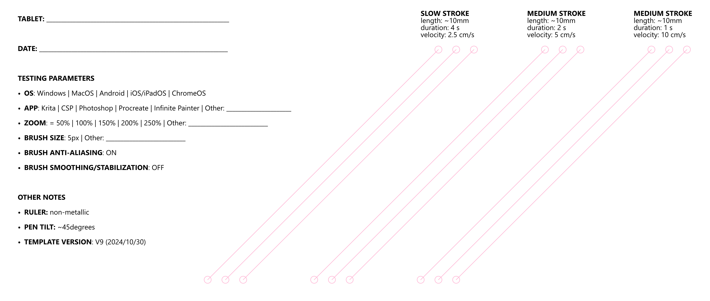

# Measuring diagonal wobble

I measure [Diagonal wobble](../../core/diagonal-wobble.md) using a simple procedure.

## Resources

**Diagonal template image** - A standard PNG created using Adobe Illustrator. It provides visual guides that make testing easier. The image is shown later in this doc.

**Ruler** - I use a simple plastic ruler. I do not use metal rulers because they might interfere with the EMR technology in the pen.

**Driver** - I use the latest manufacturer driver. For very old tablets that don't have recent drivers, I use OpenTabletDriver.

**Application** - Krita

## Testing process

* Verify the plastic ruler has no rough spots or bumps that would affect the measurement. It should be smooth.
* Tablet configuration
  * For pen tablets, set the active area to a single display.
  * For pen tablets, set the driver to match the aspect ratio of the tablet to the display.
* App configuration
  * Load the diagonal template image.
  * Set Krita zoom to 100%.
  * Set the brush to **Ink-2 Fineliner** with the default brush settings and a size of 5 pixels.
* Drawing
  * The template requires 3 sets of lines drawn at different speeds - 3 lines for each speed
  * Draw the line from the lower left to the upper right.
    * Follow the specified speed as much as possible
    * Keep the pen tilt at about 30 to 40 degrees from vertical.
* Save as a PNG

## Evaluating wobble (draft)

**Considerations**

* **MAGNITUDE** - How far the wobble is physically displaced from the center of the line.
* **VELOCITY** - Whether wobble is visible in slow, medium, and fast strokes.

**Scale**

* **VERY LOW** - Strokes easily confused for a perfectly straight line
* **LOW** - Lines are mostly straight with occasional minor wobble.
* **MEDIUM** - Moderate wobble is visible in most lines.
* **HIGH** - Moderate wobble is visible in many lines.
* **VERY HIGH** - Heavy wobble is visible in many lines.

## Wobble testing template image

<figure><figcaption></figcaption></figure>
