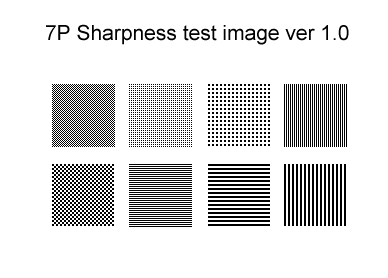

# Measuring display sharpness

## Overview

Pen displays have some anti-glare treatment that introduces a small amount of blur. It can vary widely between pen displays. I've created a simple test image so I can consistently evaluate the blur.

## Test image

It's a small PNG file with black and white pixels.

There are 8 samples.

<figure><figcaption></figcaption></figure>

## Process

* Open the image in Krita
* Set the zoom to 100% so that every pixel in the image corresponds to exactly 1 pixel on the display.
