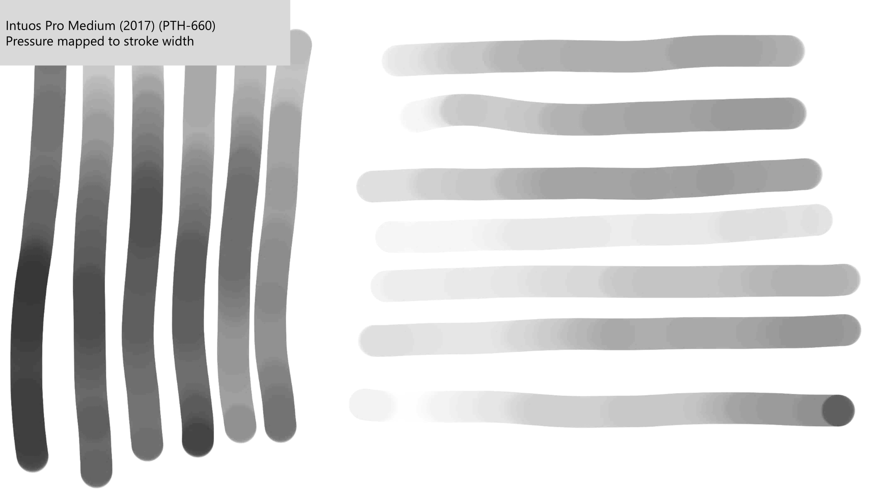
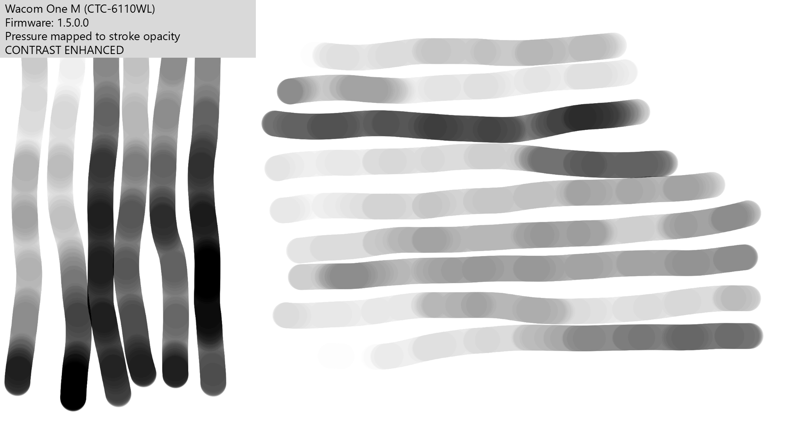

# Measuring pressure banding

## Background

See: [Pressure banding](../../core/pressure/pressure-banding.md)

## How to test

Open Krita

Ensure all pressure curves in driver and in Krita are set to the null pressure curve

Create a brush with

* Width 100px
* Pressure mapped to opacity (press harder to make stroke more opaque)

Draw a series of horizontal and vertical lines at a constant pressure, toward the low end of the pressure range.

Perform some contrast enhancement on the image to help see the banding

## A good result - no banding

There is no banding here.

<figure><figcaption></figcaption></figure>

## A bad result - banding visible

<figure><figcaption></figcaption></figure>
