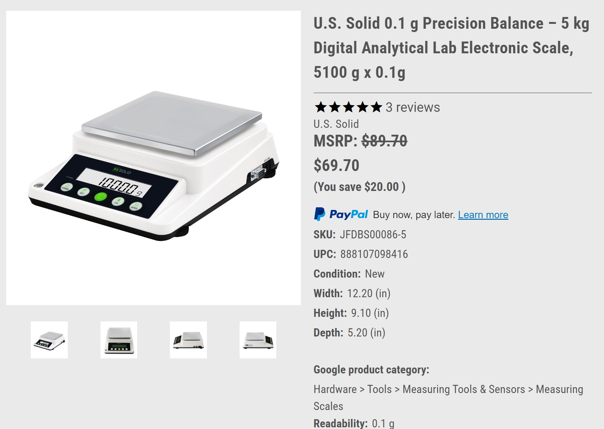
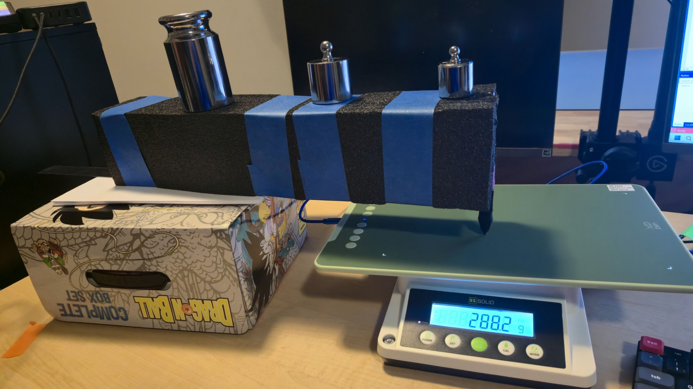

# Measuring pressure

## Scale

I use this scale US Solid Scale (model number USS-DBS86-5).

It is delicate enough to measure 0.1g which makes it good for IAF testing and can support 5kg of weight which is good for handling the weight of smaller pen displays.

* [Link to scale on us solid site](https://ussolid.com/u-s-solid-0-1-g-precision-balance-5-kg-digital-analytical-lab-electronic-scale-5100-g-x-0-1g.html) ([archived link](https://archive.is/JtDyk))
* [Instruction manual](https://file.ussolid.com/content/USS-DBS/Instruction%20Manual-USS-DBS86%20Precision%20Balance.pdf)

<figure><figcaption></figcaption></figure>

## Connecting the scale to a computer

### Cable

This specific cable works to connect the serial port on the scale to a USB port on the PC

CableCreation USB to RS232 Adapter with PL2303 Chipset ([amazon link](https://www.amazon.com/dp/B0769DVQM1))

### Programmatically getting the pressure data to a PC

Tablet expert Kuuube, has provided some sample code to read the data from the scale into a PC using Python. See the GitHub project here: [**us\_solid\_scale\_reader**](https://github.com/Kuuuube/Misc_Scripts/tree/main/scripts_and_programs/us_solid_scale_reader)

## Full setup

As of September 2025 my setup looks like this:

* A foam block holds the pen and serves as an arm
* An incision on the foam is used to securely hold the pen.
  * It does struggle with some pens that are thinner and "slip" a bit as pressure gets towards 400gf.
* A metal ruler underneath the foam adds some stiffness
* Masking tape secures the ruler to the foam
* Weights on top of the foam are added and moved to adjust the pressure and to secure the arm

<figure><figcaption></figcaption></figure>

## Videos

* [SevenPens - Measuring Pen Pressure Response Curves](https://youtu.be/tioJ3CfrmtI) - 2025-09-27
