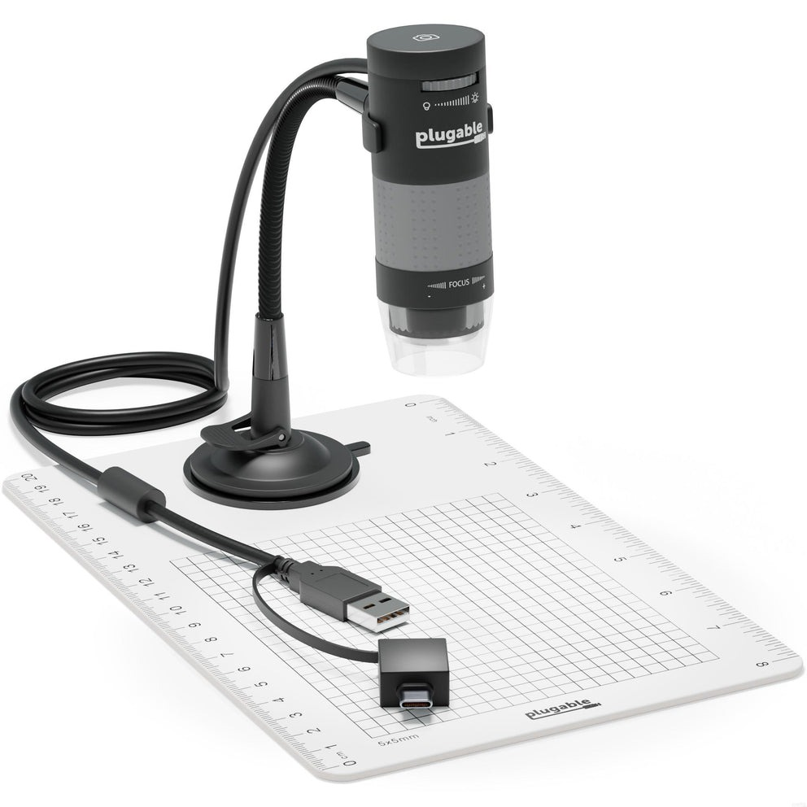

# Microscope

## Overview

Occasionally I use this microscope to get close-up pictures of nibs, and sometimes LCD panels.

## Basics

* Brand: Plugable (yes only one "g")
* Brand: Plugable (yes, only one "g")
* Model: USB2-MICRO-250X
* Software: Plugable Digital Viewer App
* Product page: [https://plugable.com/products/usb2-micro-250x](https://plugable.com/products/usb2-micro-250x) ([archived](https://archive.is/1q71u))

<figure><figcaption></figcaption></figure>

## Notes

* The microscope behaves just like a webcam. You can use your computer's built-in camera app to see the image it produces.
* Optionally, you can install the Plugable Digital Viewer App which provides some additional features.
