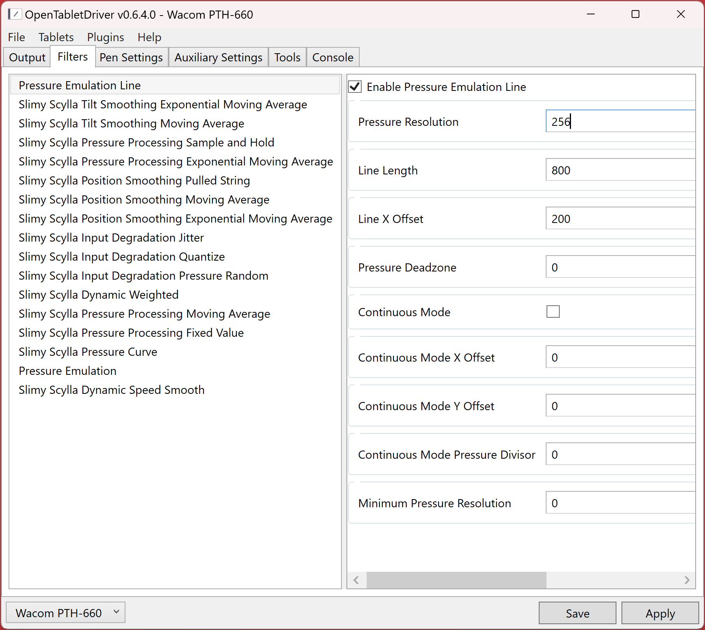

# Perfect pressure strokes

## Overview

For some kinds of testing or investigation, it's useful to remove "the human element." With pressure, it's not possible for a human to push down on the tip of the pen with a perfectly monotonic change in pressure.

For this purpose, I use Kuuube's Pressure Emulation plugin for OpenTabletDriver.

You can download the plugin from here: [https://github.com/Kuuuube/Pressure\_Emulation](https://github.com/Kuuuube/Pressure_Emulation)

## My standard configuration

Pressure Resolution - to simulate N levels of pressure. Shown below is 256. Setting it to zero does not affect the pressure values.

Line length - 800

Line X Offset - 200

<figure><figcaption></figcaption></figure>
