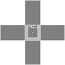

# Tablet notes template

These are my notes on the things to look at when I evaluate a tablet. This is a work in progress and evolves over time.&#x20;

## Basics&#x20;

* Product information
  * name
  * model number
  * launch year
  * product page with archive link
* Active area
  * Dimensions (width x height)
  * Diagonal length
  * Size category: small, medium, large
    * link to size categories
  * Aspect ratio
  * Closest standed paper size
*   What's in the box&#x20;

## Specs

* Digitizer specs
  * type: EMR
  * digitizer resolution (LPI and LIMM)
  * Number of pressure levels
  * Tilt
  * Tilt range
  * Report rate
* Display specs
  * Display panel:
  * Native resolution
  * Aspect ratio
  * Surface:
  * Lamination:
  * Brightness
  * Response Time
  * Refresh rate
  * Color bi depth
  * Color gamut:
  * Color modes
* Pens
  * Included pen
    * Default nib
      * Eval of pen should be in separate doc
  * Pen compatibility
    * Compatible
    * Incompatible pens (if needed for clarification)
* Device&#x20;
  * Size
  * Weight
  * Ports

### Display

* Brightness
* Display color fringing
* Dead pixels
* Pixel layout
* Blacks
* AG sparkle
  * How close to notice
  * How much of colorful rainbow effect
* Viewing angle
  * look for loss of contrast
* Surface protection
  * Does it come with screen protector
  * Is a first party screen protector available
* Sharpness
  * Looking for clearly defined pixel
  * Looking for lack of "softness"
  *

      
<figure><figcaption></figcaption></figure>

* Display OSD
  * how to activate
  * menus
  * responds to touch?
  * will OSD respond to touch when touch is disabled

## Drawing performance

* Static track accuracy
  * Stated accuracy from manufacturer
* Corner and edge accuracy&#x20;
  * Look for accuracy at corners and edges
* Tilt compensation
* Tilt at edges and corners
* Diagonal wobble
  * [Measuring diagonal wobble](measuring-diagonal-wobble.md)
* Artifacts at low pressure
* Pressure banding
* PEN Pressure range (IAF and MAX)
* Pressure scan rate
* Parallax
* Pointer lag
* Pen tilt near edges and corners
* Surface texture
* Backlight bleed

## Connections and cablings

* Are ports recessed
* What cables are included
  * 3-in-1
  * other
* Connection opton diagams
  * Are cables included
* Does it support single USB-cable connection

## Other inputs

* Express keys
* Dials
* Sliders
* Touch
  * Is touch supported? On Windows? On MacOS?

## Ergonomics

* VESA
  * Which VESA size
  * If you used it with an monitor arm, identify the arm
* Stand
  * Identify model number of stand
  * Does the stand use VESA mounting?
  * How much wobble does the stand have
  * Does the stand support height adjustment
  * Does the stand support tilt adjustment
  * If you used it with stand , identify the stand
* Legs
* Fans
* Noise
* Heat
  * 50% for an hour
  * 100% for an hour
  * hotspots?

## Usage scenario

* With Androird
* With Chromebook
* Can you use the pen display as a pen tablet?&#x20;

