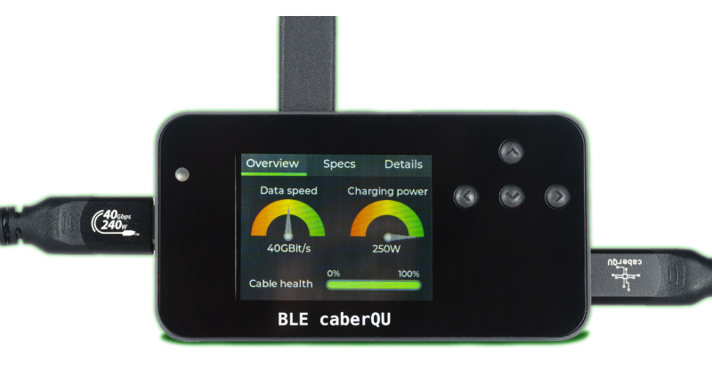

# Testing USB-C cables

Because it is hard to tell what a USB-C cable supports, I use this tool to test them: BLE caberQU.

PRODUCT LINK: [https://caberqu.com/content/8-ble-caberqu](https://caberqu.com/content/8-ble-caberqu)

<figure><figcaption></figcaption></figure>
