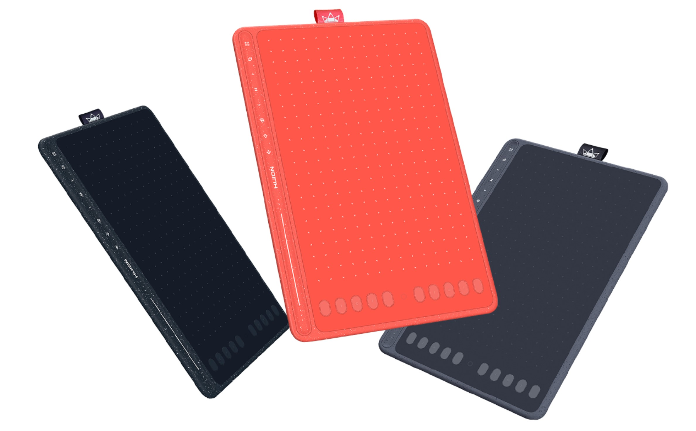
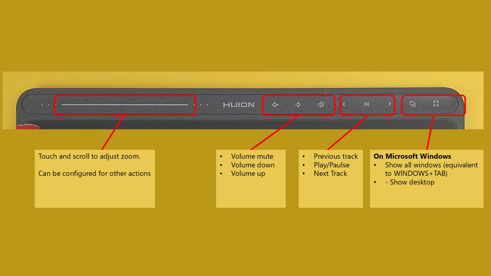

# 7P notes: Huion Inspiroy HS611

## **Summary**

This is a slightly older Huion model from 2019 but is still a decent drawing tablet.&#x20;

If you get it, then it will work fine. But you should consider the newer Huion pen tablets at the same price point as the HS611.&#x20;

<figure><figcaption></figcaption></figure>

<figure><figcaption></figcaption></figure>

## **Active area size**

This is is a MEDIUM sized tablet, with a diagonal length about 1.5" larger than a Wacom Intuos Pro medium

<table><thead><tr><th width="268">Tablet</th><th width="134">Dimensions</th><th>Diagonal Length</th></tr></thead><tbody><tr><td><strong>Huion Inspiroy HS611</strong></td><td>10.17 x 6.36"</td><td>12"</td></tr><tr><td>
Wacom Intuos Pro Medium

(PTH-660):
</td><td>8.7 x 5.8”</td><td>10.57”</td></tr></tbody></table>

## Aspect ratio

This tablet has a 16:10 aspect ratio.

## **Pen**

The tablet uses he the slightly older PW500 pen. For more details about the pen, see [<mark style="background-color:green;">**My notes on the PW500 pen**</mark>](../huion-pen-models/7p-notes-huion-pw500-pen.md)&#x20;

## **Build quality & design**

The HS611 has a very simple design. No complaints, though it lacks the refined look and feel of the newer Huion tablets.&#x20;

It is also available in several colors (Space Grey, Starr Blue, and Coral Red). I have the Space Grey version.

<figure><figcaption></figcaption></figure>

There is one cool aspect of its design. Unlike the vast majority of tablets, this one has regions with a slighted speckled pattern. This adds a bit of visual distinction.

<figure><figcaption></figcaption></figure>

## **Surface texture**

The drawing surface is only very slightly textured. If you are used to a modern drawing tablets, you might find this texture slightly "slippery".

In comparison:

* The texture feels much smoother than the Wacom Intuos Pro (PTH-x60 series).
* A little more texture than the surface of an iPad.

## **Auxiliary inputs > buttons**

It has 10 programmable buttons on the left. 10 more than most other tablets.

The 10 buttons are in 2 groups of 5.

Each group of five s some raised symbols on the buttons to help you identify the buttons by touch alone and without looking.

<figure><figcaption></figcaption></figure>

## **Auxiliary inputs > touch controls**

* Touch controls - At the top there are some additional touch-sensitive keys.
  * One is a slider that can be configured to adjust zoom, brush size, or vertical scrolling
  * The rest control media-related features &#x20;

<figure><figcaption></figcaption></figure>

Both the buttons and the touch-sensitive controls can be turned off in the dricer.

## **Touch**

This tablet does NOT support touch

## **Cables and connections**

**Wireless -** This tablet does NOT support a wireless connect

**Wired connection** - there is a single USB-C port&#x20;

## **Tilt compensation**

OK. Exhibits a moderate amount of displacement of the pointer when the pen is tilted at 45 degrees. Because it is a pen tablet this amount of displacement will not be very noticable unless you are specifically looking for it.

## Drawing fundamentals

* Pressure handling seemed smooth when transitioning between low to high pressure
* Tilt worked as expected&#x20;
* I didn't notice anything unusual at all.

## Pressure instability/wobble

Very good. Even when drawing at very low amount of pressure with a very large brush (1000px) in Krita, pressure didn't exhibit and wild swings or wobble.

## **Diagonal wobble**

It exhibits some diagonal wobble. The wobble is most noticable at slower speeds. In practice when I draw i did not notice this much. Adding a little bit of brush smoothing controlled it.

<figure><figcaption></figcaption></figure>
