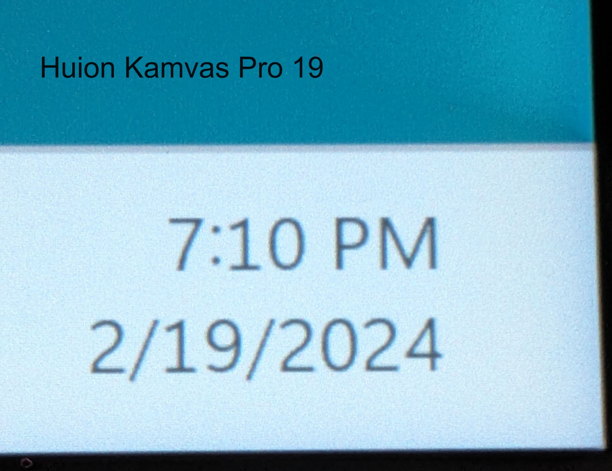

# 7P notes: Huion Kamvas Pro 19 (GT1902)

## Summary

I do recommend this tablet. The drawing experience is the best Huion's ever had.&#x20;

Is it as good as a Wacom Cintiq Pro? No. But it is VERY GOOD.

## Basics

* **Corner/Edge accuracy** - NORMAL. This is only visible in the last 2mm and did not affect my normal usage of the tablet. It was so minor, I didn't even bother performing any calibration to address it.
* **Pointer lag** - NORMAL - standard for modern pen displays.
* **Parallax** - NORMAL - standard for modern pen displays.

## **Display**

**Refresh rate** - NORMAL. Up to 60Hz which is standard for pen displays in 2024. Does not support 120Hz.

**Anti-Glare sparkle** - OK. This is a BIG IMPROVEMENT over some older Huion models. Slightly noticeable at 6 inches. At normal drawing distance for me not noticeable. I am very happy with the outcome. In comparison the Wacom Cintiq Pro 16 (DTK-167) has a little less AG sparkle.

**Sharpness** - OK. the anti-glare treatment diffuses the light coming from the display. The result is that the pixels on the display are "soft" and not as crisp as on comparable 16" or 22" displays. Several other people with this tablet have commented on the same thing. For me this is not a problem. In comparison, even the Wacom Cintiq Pro 16 (DTK-167) has a slightly soft experience, this Huion has a little more softness than that.

Wacom Cintiq Pro 22&#x20;

&#x20;.jpg>)

Huion Kamvas Pro 19

<figure><figcaption></figcaption></figure>

**Brightness** - seems as advertised. I thought it was fine. It's not especially bright - but I thought it was bright enough at 100%.

**Parallax** - VERY GOOD. It has very little parallax. As good as - maybe even a little better than the Wacom Cintiq Pro 22 in my observation.

## Compatibility

**Backwards compatibility with the older PW517 pen** - not compatible. Or at least not completely compatible. The PW517 pen will move the pointer, but not there is no pressure detected so drawing is useless.

## **Connections and cabling**

**Single USB-C cable connection?**

I could not use it with a single USB-C cable. Huion did not say that single-cable operation was a feature - so I am not surprised. Tablets above 16 inches generally require additional power.

* Power: I have it connected with its USB-C power cable to the provided power adapter.
* Data and display signal: I used the supplied USB-C cable to connect it to my Microsoft Surface Thunderbolt Dock. I connected the dock to a Microsoft Surface Pro 8. For MacOS testing I connected the dock to an M3 MacBook Pro.

**Using third party USB-C cables for display signal & data**

I tried a Cable Matters USB-C Thunderbolt cable. It did work, however sometimes slight movements of the cable cause the tablet to lose the display signal and data.

Upon closer examination, the Huion USB-C cable plug is slightly longer than the CableMatters cable. So there is a slight difference on how some third party cables can connect.

For this reason I recommend using the supplied Huion USB-C cable.

## Touch

* **Touch on MacOS** - DOES NOTHING. Which is what Huion said it would do. So, no surprise.
* **Touch on Windows** - Still under evaluation.
  * By default, touch on the tablet will normally map to whichever display is your "main monitor".&#x20;
  * You can map touch back to the tablet when it is not the main monitor. See this document from Huion: [How to make finger gestures control Kamvas Studio 16/Kamvas Pro 19/Kamvas Pro 27 instead of the external monitor](https://support.huion.com/en/support/solutions/articles/44002416035-how-to-make-finger-gestures-control-kamvas-studio-16-kamvas-pro-19-kamvas-pro-27-instead-of-the-exter). When I first tried this, it fixed the touch problem, but it had an odd interaction with the pen - when I used the pen on the tablet, the pointer always stayed near the top border. After I uninstalled the driver, restarted the computer, and reinstalled the driver, the problem went away and the pen worked normally.
* **Palm rejection**: OK. Very TYPICAL for Touch on pen displays.&#x20;
  * Touch support is not comparable to an iPad's touch support which is EXCELLENT. Too often I accidentally pressed something on the screen because of my palm.&#x20;
  * I would say it's very on par with the Cintiq Pro 22 and Cintiq Pro 27.  I didn't try to use a drawing glove yet.&#x20;
  * Brad Colbow in his review of the Kamvas Pro 27 noticed that the palm rejection didn't seem to result in accidental drawing, but rather accidental clicks. I had the same experience.
  * Note: I used the tablet without using any drawing glove. In theory a drawing glove would help with the palm-rejection.&#x20;

## **Ergonomics**

**Weight** - lighter than I expected. I noticed it immediately when I picked up the box.&#x20;

**VESA mounting** - YES. There are 75 mm × 75 mm VESA holes for mounting on the back.&#x20;

**Legs** - YES. Two legs

**Noise** - EXCELLENT. No noise because no fans

**Heat** - EXCELLENT. After running at 100% brightness for 10 days: room temperature on the left side. Just very slightly warmer on the right.&#x20;

**Stand** - It does not come with a stand. Instead, I used separately-purchased Huion ST100A stand which attaches to this pen display using the VESA mounting holes.&#x20;

**Surface texture** - it feels slightly more textured than the Huion Kamvas Pro 24 4K

## Pens and Pressure

**Pens** - comes with the PW600 and PW600S pens.&#x20;

**Driver & Pens** - the driver knows that there are two different pen models and has separate button settings for each. However settings like the driver pressure curve are the shared across both pens.&#x20;

**Pen buttons** - GOOD. the PW600 has 3 buttons. The PW600S has two buttons.

**Pen button feel** - GOOD. the buttons on both pens have a nicer "crisper" clicking action than the buttons of the PW517 which feel a bit soft/mushy in comparison

**Pen IAF** - GOOD. Huion says 2gf for both pens. Seems accurate. A little more sensitive than the PW517 pen which is at about 3gf.

**Pen maximum pressure** - VERY GOOD. I measured both pens at 510gf (slightly \*more\* than the 500gf that Huion specified). This amount of variance is normal.

**Pressure Transition Instability** - VERY GOOD. You may remember the issues I pointed out with the Huion Inspiroy 2 L and the Wacom One M. That the problem is not visible with this tablet and pen. Remember: All tablets have some amount of it. Desirable tablets just have a very small amount of it and you have to construct situations to reveal it. This tablet so far seems comparable to what I see with the Wacom Intuos Pro & Cintiq Pro tablets.&#x20;

**Pen button stroke interruptions** - While drawing with older Huion pens the buttons would might interrupt the drawing - even if you disabled the buttons in the driver. With the new pens, the buttons do not interfere with the stroke.

**PW600/PW600S compatibility with older tablets** - The new pens are NOT compatible with older Huion tablets.

**Pen weight** - I measured with a digital scale

* PW517 = 14g
* PW600 = 16g
* PW600S = 14g

**Issue with the PW600 pen & nib** - On the third day of using the tablet the PW600 pen would click or draw even when it was hovering. I did drop the pen at some point during the third day and that may have triggered something. I removed the nib, saw the nib was bent and replaced it with a fresh nib and the problem went away.&#x20;

**Default nib** - The default pre-installed nib on both the PW600 and PW600s pens is the felt nib, no the plasti nib.&#x20;

**Pen eraser** - the PW600 and PW600S pens do have an eraser. I don't user erasers so don't have any particular comment on it.

**Pen tilt compensation** - VERY GOOD. The pointer stays where the nib is during normal ranges of tilt with some deviation only at extreme angles.

## Diagonal wobble

GOOD. LOW amounts of wobble in stroke.

<figure><figcaption></figcaption></figure>

## Compared to the Huion Kamvas Pro 24 4K (GT2401)

The Huion Kamvas Pro 24 4K (GT2401) was Huion's flagship pen display for a few years. And now the the Kamvas Pro 19 and Kamvas Pro 27 tablets represent the new flagship tablets.  &#x20;

The new tablets have clear improvements in these areas.

* Pressure handling through the new PenTech 4.0  is clearly better.
* The new pens have an eraser and that night be important for you
* The new tablets have less AG sparkle&#x20;
* The new tablets have touch&#x20;

There are a few areas that might not compare as well though

* The new anti-glare treatment gives a slightly soft look to the pixels in the Kamvas Pro 19 at least. I didn't test the Kamvas Pro 27 so not sure how much the softness is present in that model.
* Currently there is no exact match in terms of size to the 24". Drawing on 19" feels very different than 24".&#x20;
* The new tablets are a bit more expensive for their size.

But for other areas, the Kamvas Pro 24 4K was already a good pen display. So for this reason, if you already have a Huion Kamvas Pro 24 4K (GT2401) then these new tablets are NOT an immediate "MUST BUY". If you are happy with how your Kamvas Pro 24 4K is working, then keep it. I would suggest at least waiting to see if Huion releases something closer to a 24" size.&#x20;

## Other topics

**Sound** - there's a headphone jack for audio. Some of you may find this convenient.

In Windows if you connect the tablet, it may **appear** that windows has lost sound output. What is happening here is Windows can automatically switch its default audio to a new audio device - which is what this tablet is. Of course, it doesn't have speakers, so you won't hear anything unless you have a headphone connected.&#x20;

**Driver > Active Area mapping on resume from sleep on Windows** - On Windows, when resuming from sleep the Huion driver can occasionally become be confused about how to map the active area of the tablet to the screen. It may choose the wrong screen. It map span across both screens. When it does this it may not track the pen position correctly. This is resolved just by restarting Windows. This is a well-known issue with Huion drivers. Not a serious problem but a minor irritation.&#x20;
